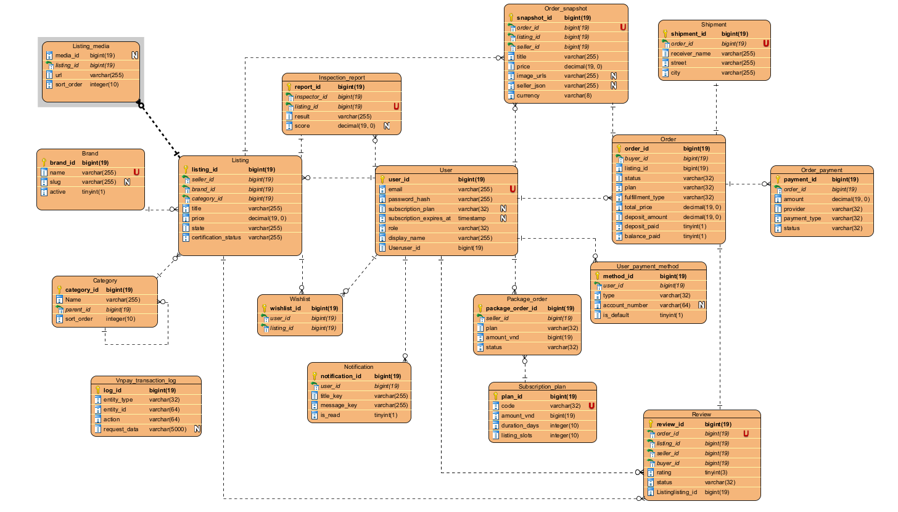

# 📊 ERD Diagram

## 1. Description

ShopBike is an online bicycle marketplace system that connects buyers and sellers in a transparent and well-structured trading environment.

Sellers can create and manage bicycle listings with information such as brand, category, price, images, and certification status.

Buyers can search for products, place orders, make payments, and track order status. The system also supports inspection reports to ensure product quality.

In addition, the system handles order processing, payment (VNPay integration), shipping, and post-purchase reviews, along with supporting features such as wishlists, notifications, and seller subscription plans.

---

## 2. ERD Image

---

## 3. Entities Overview

### Core entities
- User
- Listing
- Order
- Brand
- Category

### Transaction & Payment
- Order_Payment
- Package_Order
- VNPay_Transaction_Log

### Supporting entities
- Listing_Media
- Inspection_Report
- Order_Snapshot
- Shipment
- Review
- Wishlist
- Notification
- User_Payment_Method
- Subscription_Plan

---

## 4. Relationships

- User 1 → N Listing
- User 1 → N Order
- Listing 1 → N Listing_Media
- Listing 1 → 1 Inspection_Report
- Order 1 → N Order_Payment
- Order 1 → 1 Shipment
- User 1 → N Review
- Category 1 → N Listing
- Brand 1 → N Listing

---

## 5. Key Tables Detail

### User
- user_id (PK, bigint)
- email (UK, varchar)
- password_hash (varchar)
- role (varchar)
- display_name (varchar)
- subscription_plan (varchar)
- subscription_expires_at (timestamp)

### Listing
- listing_id (PK)
- seller_id (FK → User)
- brand_id (FK → Brand)
- category_id (FK → Category)
- title (varchar)
- price (decimal)
- state (varchar)

### Order
- order_id (PK)
- buyer_id (FK → User)
- listing_id (FK)
- status (varchar)
- total_price (decimal)

### Order_Payment
- payment_id (PK)
- order_id (FK)
- amount (decimal)
- provider (varchar)
- status (varchar)

### Listing_Media
- media_id (PK)
- listing_id (FK)
- url (varchar)

---

## 6. Relationship Explanation

- A User can create multiple Listings and Orders.
- Each Order belongs to one User (Buyer) and one Listing.
- Each Listing can have multiple images (Listing_Media).
- Each Order has one Payment and one Shipment.

---

## 7. Notes

- This ERD was designed using Visual Paradigm to model the database structure of the ShopBike system.
- The diagram includes all core entities, supporting entities, and their relationships.
- It follows a relational database design approach to ensure data consistency and scalability.
- The system supports key business flows such as listing management, ordering, payment processing, and user interactions.

