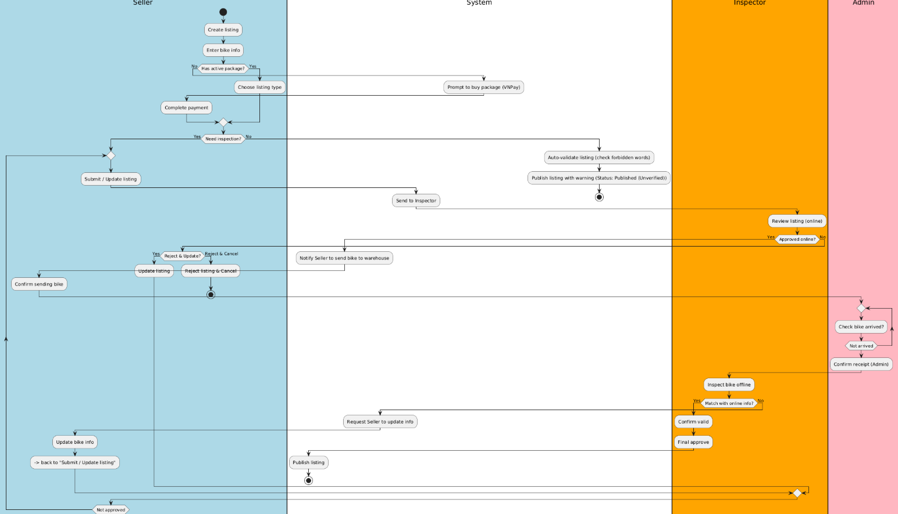
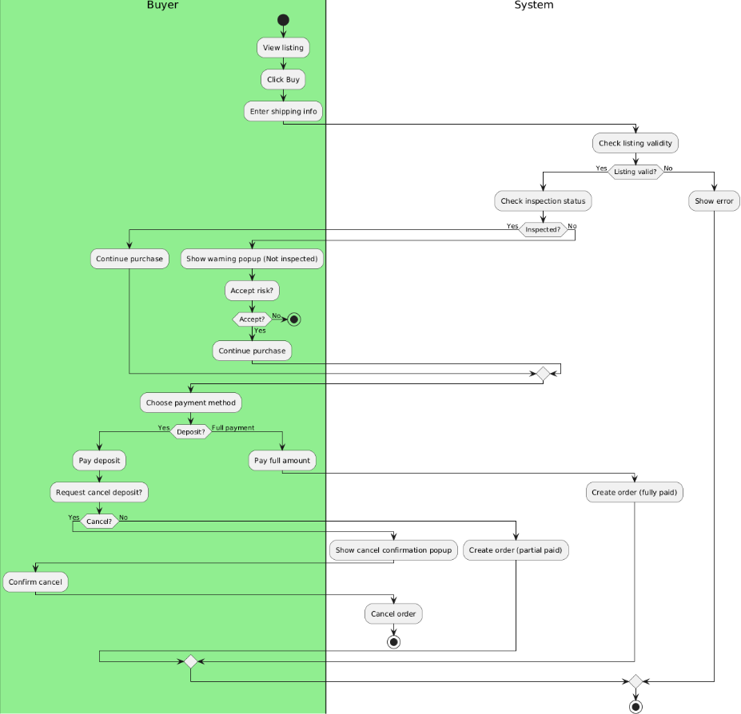
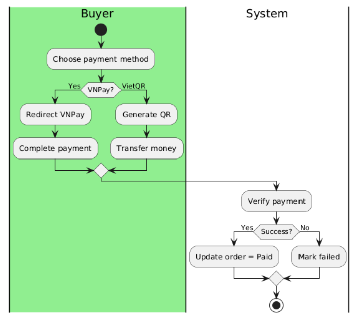
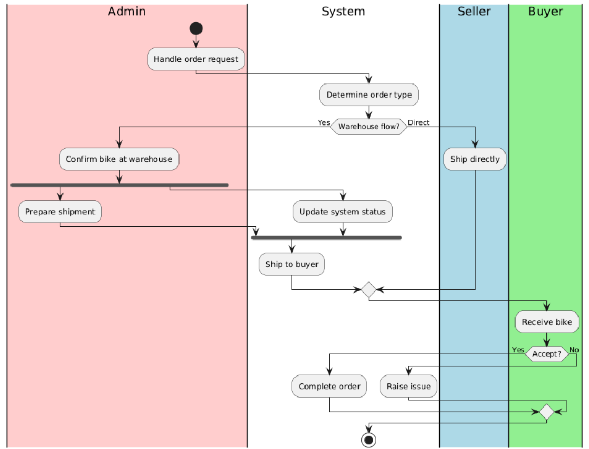
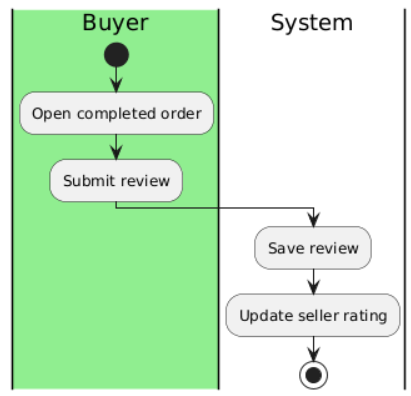

# ShopBike

## 📌 Description
This system is designed to support a secure and reliable marketplace for used bikes, integrating multi-stage inspection processes (online and offline) to ensure product authenticity and enhance transaction trust.

---

## 👥 Actors
- Buyer
- Seller
- Inspector
- Admin

---

## 🔄 Workflow
1. Seller Bike Listing and Selling Workflow with Inspection
2. Buyer browses listings and places an order  
3. Payment Processing & Verification
4. Seller arranges shipment and delivery  
5. Buyer submits post-purchase evaluation  

---

## 📊 Activity Diagram (Swimlane)

### 1. Listing Creation

  

---

### 2. Order Placement

  

---

### 3. Payment Processing & Verification

  

---

### 4. Shipment and Delivery

  

---

### 5. Post-Purchase Evaluation

  

---
