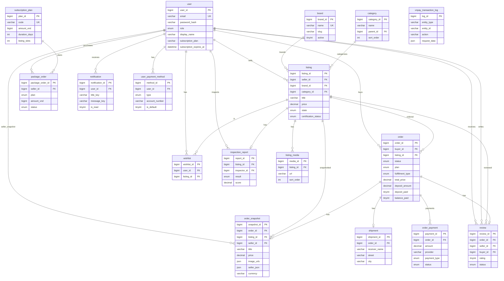

# Hướng dẫn: Vẽ ERD và tạo bảng MySQL — ShopBike

> Tài liệu hướng dẫn chi tiết cách vẽ ERD (Mermaid, Draw.io) và tạo bảng MySQL cho 17 bảng ShopBike.

**Tham chiếu đầy đủ:** [ERD-SPEC.md](ERD-SPEC.md) — đặc tả toàn bộ cột, ENUM, FK, luồng nghiệp vụ.  
**Schema SQL:** [sql/shopbike_mysql_schema.sql](sql/shopbike_mysql_schema.sql)  
**File Mermaid:** [sql/shopbike_erd.mmd](sql/shopbike_erd.mmd)

---

## 1. Code Mermaid (copy-paste)

Copy đoạn sau vào [mermaid.live](https://mermaid.live) hoặc file `.mmd`:



**Xuất ảnh:** Mermaid Live → Generate → PNG/SVG → tải về.

---

## 2. Bước vẽ ERD chi tiết

### 2.1. Quy ước ký hiệu (Mermaid / Crow's Foot)

| Ký hiệu | Ý nghĩa | Ví dụ |
|---------|---------|-------|
| `\|` | Đúng 1 (one) | Một order có đúng 1 shipment |
| `o{` | Nhiều (many) | Một user có nhiều order |
| `\|\|--o{` | 1:N (one-to-many) | user → listing (1 user nhiều tin) |
| `\|\|--o\|` | 1:1 (one-to-one) | order → order_snapshot (1 order 1 snapshot) |
| PK | Primary Key | Gạch dưới hoặc chữ PK |
| FK | Foreign Key | Cột tham chiếu bảng khác |
| UK | Unique Key | Email, code |

### 2.2. Thứ tự vẽ bảng (theo phụ thuộc FK)

Vẽ theo thứ tự này để bảng tham chiếu đã tồn tại:

| Bước | Bảng | Phụ thuộc |
|------|------|-----------|
| 1 | user | Không |
| 2 | brand | Không |
| 3 | category | parent_id → category (self) |
| 4 | subscription_plan | Không |
| 5 | listing | user, brand, category |
| 6 | listing_media | listing |
| 7 | inspection_report | listing, user |
| 8 | order | user, listing |
| 9 | order_snapshot | order, listing, user |
| 10 | shipment | order |
| 11 | order_payment | order |
| 12 | review | order, listing, user |
| 13 | package_order | user |
| 14 | user_payment_method | user |
| 15 | wishlist | user, listing |
| 16 | notification | user |
| 17 | vnpay_transaction_log | Không |

### 2.3. Ma trận quan hệ (nối cạnh nào)

| Từ | Đến | Cardinality | Nhãn |
|----|-----|-------------|------|
| user | listing | 1:N | sells |
| user | order | 1:N | buys |
| user | package_order | 1:N | purchases |
| user | review | 1:N | receives / writes |
| user | wishlist | 1:N | has |
| user | notification | 1:N | receives |
| user | user_payment_method | 1:N | has |
| user | inspection_report | 1:N | inspects |
| user | order_snapshot | 1:N | seller_snapshot (qua seller_id) |
| brand | listing | 1:N | brands |
| category | listing | 1:N | categorizes |
| listing | listing_media | 1:N | has |
| listing | inspection_report | 1:1 | has |
| listing | order | 1:N | ordered |
| listing | review | 1:N | reviewed |
| listing | wishlist | 1:N | in |
| listing | order_snapshot | 1:N | snapshotted |
| order | order_snapshot | 1:1 | has |
| order | shipment | 1:1 | has |
| order | order_payment | 1:N | payments |
| order | review | 1:1 | has |
| subscription_plan | package_order | 1:N | plans |

### 2.4. Quy ước đặt tên

| Loại | Quy ước | Ví dụ |
|------|---------|-------|
| PK | `{bảng}_id` hoặc `{bảng}id` | user_id, listing_id, order_id |
| FK | `{bảng_tham_chiếu}_id` | seller_id, buyer_id, brand_id |
| Index | `idx_{bảng}_{cột}` | idx_listing_state, idx_order_buyer |
| Unique | `uk_{bảng}_{cột}` | uk_user_email, uk_snapshot_order |
| Foreign key constraint | `fk_{bảng}_{cột}` | fk_listing_seller |

---

## 3. Bảng ENUM đầy đủ

> Chi tiết đầy đủ xem [ERD-SPEC.md](ERD-SPEC.md).

| Bảng | Cột | Giá trị ENUM |
|------|-----|--------------|
| user | role | BUYER, SELLER, INSPECTOR, ADMIN |
| listing | condition | NEW, LIKE_NEW, MINT_USED, GOOD_USED, FAIR_USED |
| listing | state | DRAFT, PENDING_INSPECTION, AWAITING_WAREHOUSE, AT_WAREHOUSE_PENDING_VERIFY, AT_WAREHOUSE_PENDING_RE_INSPECTION, NEED_UPDATE, PUBLISHED, RESERVED, IN_TRANSACTION, SOLD, REJECTED |
| listing | inspection_result | APPROVE, REJECT, NEED_UPDATE |
| listing | certification_status | UNVERIFIED, PENDING_CERTIFICATION, PENDING_WAREHOUSE, CERTIFIED |
| listing_media | media_type | IMAGE, VIDEO |
| inspection_report | result | APPROVE, REJECT, NEED_UPDATE |
| order | status | PENDING, RESERVED, PENDING_SELLER_SHIP, SELLER_SHIPPED, AT_WAREHOUSE_PENDING_ADMIN, RE_INSPECTION, RE_INSPECTION_DONE, SHIPPING, IN_TRANSACTION, COMPLETED, CANCELLED, REFUNDED |
| order | plan | DEPOSIT, FULL |
| order | fulfillment_type | WAREHOUSE, DIRECT |
| order_payment | payment_type | DEPOSIT, BALANCE, FULL |
| order_payment | status | PENDING, PAID, FAILED, REFUNDED, EXPIRED |
| review | status | PENDING, APPROVED, EDITED, HIDDEN |
| package_order | plan | BASIC, VIP |
| package_order | status | PENDING, COMPLETED, FAILED |
| user_payment_method | type | BANK_TRANSFER, VISA, MASTERCARD |

---

## 4. Vẽ trên Draw.io (diagrams.net)

### Cách A: Import Mermaid

1. Mở [draw.io](https://app.diagrams.net/) hoặc diagrams.net.
2. **Arrange** → **Insert** → **Advanced** → **Mermaid**.
3. Dán code Mermaid từ mục 1 → **Insert**.
4. Chỉnh layout nếu cần (sơ đồ có thể bị tách nhiều shape).

### Cách B: Vẽ thủ công (Crow's Foot / Chen)

#### Bước 1: Tạo entity

Với mỗi bảng:
- Tạo **1 hình chữ nhật**.
- Tên bảng: `user`, `listing`, ...
- Cột: gạch dưới PK, ghi (FK) nếu là foreign key.

#### Bước 2: Kẻ quan hệ

- Dùng **connector** nối 2 entity.
- Ghi cardinality: `1` — `N`, hoặc `1` — `1`.
- Ghi nhãn: sells, buys, has, ...

#### Bước 3: Bảng tham chiếu nhanh

| Entity | PK | Thuộc tính chính |
|--------|-----|------------------|
| user | user_id | email UK, password_hash, role, display_name, subscription_plan |
| brand | brand_id | name UK, slug, active |
| category | category_id | name, parent_id FK, sort_order |
| listing | listing_id | seller_id FK, brand_id FK, category_id FK, title, price, state, certification_status |
| listing_media | media_id | listing_id FK, url, media_type, sort_order |
| inspection_report | report_id | listing_id FK UK, inspector_id FK, result, score |
| order | order_id | buyer_id FK, listing_id FK, status, plan, fulfillment_type, total_price, deposit_amount, deposit_paid, balance_paid |
| order_snapshot | snapshot_id | order_id FK UK, listing_id FK, seller_id FK, title, price, currency, image_urls, seller_json |
| shipment | shipment_id | order_id FK UK, receiver_name, street, city |
| order_payment | payment_id | order_id FK, amount, provider, payment_type, status |
| review | review_id | order_id FK UK, listing_id FK, seller_id FK, buyer_id FK, rating, status |
| subscription_plan | plan_id | code UK, amount_vnd, duration_days, listing_slots |
| package_order | package_order_id | seller_id FK, plan, amount_vnd, status |
| user_payment_method | method_id | user_id FK, type, account_number, is_default |
| wishlist | wishlist_id | user_id FK, listing_id FK (UK composite) |
| notification | notification_id | user_id FK, title_key, message_key, is_read |
| vnpay_transaction_log | log_id | entity_type, entity_id, action, request_data |

---

## 5. Tạo bảng trong MySQL

### Bước 1: Cài MySQL (nếu chưa có)

- **Windows:** [MySQL Installer](https://dev.mysql.com/downloads/installer/)
- **Mac:** `brew install mysql`
- **Ubuntu:** `sudo apt install mysql-server`

### Bước 2: Tạo database

```bash
mysql -u root -p -e "CREATE DATABASE IF NOT EXISTS shopbike CHARACTER SET utf8mb4 COLLATE utf8mb4_unicode_ci;"
```

### Bước 3: Chạy file SQL

Từ thư mục gốc project (chỗ có `package.json`):

```bash
mysql -u root -p shopbike < docs/sql/shopbike_mysql_schema.sql
```

Hoặc đường dẫn tuyệt đối:

```bash
mysql -u root -p shopbike < C:/SWP/frontend/docs/sql/shopbike_mysql_schema.sql
```

### Bước 4: Kiểm tra

```bash
mysql -u root -p shopbike -e "SHOW TABLES;"
```

Kỳ vọng: 17 bảng (brand, category, inspection_report, listing, listing_media, notification, order, order_payment, order_snapshot, package_order, shipment, review, subscription_plan, user, user_payment_method, vnpay_transaction_log, wishlist).

### Client đồ họa

| Công cụ | Cách dùng |
|---------|-----------|
| **MySQL Workbench** | File → Open SQL Script → chọn `shopbike_mysql_schema.sql` → Execute |
| **DBeaver** | Kết nối MySQL → right-click database → SQL Editor → paste file → Execute |
| **phpMyAdmin** | Chọn database `shopbike` → tab SQL → paste file → Go |

---

## 6. Ngữ cảnh nghiệp vụ (luồng chính)

| Luồng | Bảng liên quan | Mô tả ngắn |
|-------|----------------|------------|
| Đăng ký / Đăng nhập | user | Role: BUYER, SELLER, INSPECTOR, ADMIN |
| Seller đăng tin | user, brand, category, listing, listing_media | DRAFT → PENDING_INSPECTION → PUBLISHED |
| Inspector kiểm định | listing, inspection_report, user | result: APPROVE, REJECT, NEED_UPDATE |
| Buyer mua xe | user, listing, order, order_snapshot, shipment, order_payment | Plan: DEPOSIT (cọc 8%) hoặc FULL; fulfillment: WAREHOUSE hoặc DIRECT |
| Thanh toán VNPay | order, order_payment, vnpay_transaction_log | payment_type: DEPOSIT, BALANCE, FULL |
| Giao hàng qua kho | order (status), listing (warehouse_intake_verified_at) | Luồng WAREHOUSE |
| Đánh giá sau mua | order, review, order_snapshot (seller_id) | 1 order = 1 review, buyer đánh giá seller |
| Seller mua gói | user, subscription_plan, package_order | BASIC, VIP |
| Wishlist | user, listing, wishlist | UK (user_id, listing_id) |
| Thông báo | user, notification | title_key, message_key (i18n) |

---

## 7. File tham chiếu

| File | Nội dung |
|------|----------|
| [ERD-SPEC.md](ERD-SPEC.md) | **Đặc tả đầy đủ** — cột, kiểu, ENUM, FK, luồng nghiệp vụ |
| [ERD-MYSQL.md](ERD-MYSQL.md) | Thiết kế 17 bảng, sơ đồ Mermaid, mapping MongoDB |
| [BACKEND-NODE-TO-SPRING-BOOT.md](BACKEND-NODE-TO-SPRING-BOOT.md) | Chuyển BE Node→Spring Boot — JPA entities, endpoint map, business rules |
| [sql/shopbike_mysql_schema.sql](sql/shopbike_mysql_schema.sql) | CREATE TABLE đầy đủ |
| [sql/shopbike_erd.mmd](sql/shopbike_erd.mmd) | Nguồn Mermaid ERD |

---

*Đồng bộ: shopbike_erd.mmd, shopbike_mysql_schema.sql, ERD-SPEC.md. Cập nhật: 2026-03.*
