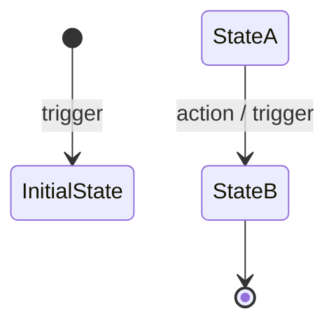

# Hướng dẫn vẽ State Chart — Từng bước cho dự án ShopBike

> Tài liệu hướng dẫn chi tiết cách vẽ **State Transition Diagram** (sơ đồ chuyển trạng thái) cho Order, Listing và Review trong dự án ShopBike.

**Tham chiếu đầy đủ:** [STATE_TRANSITION_DIAGRAM_GUIDE.md](STATE_TRANSITION_DIAGRAM_GUIDE.md) — bảng transitions, code Mermaid, nguồn tham chiếu trong code.

---

## Bước 1: Chuẩn bị

### 1.1 Chọn công cụ

| Công cụ | Ưu điểm | Nhược điểm | Gợi ý |
|--------|---------|------------|-------|
| **[Mermaid Live](https://mermaid.live)** | Code-based, copy-paste nhanh, export PNG/SVG | Ít tùy chỉnh layout | **Nên dùng** cho nộp bài / tài liệu |
| **Draw.io** (diagrams.net) | Vẽ tay, tự do layout, import Mermaid | Mất thời gian bố cục | Khi cần chỉnh sửa thủ công |
| **Excalidraw** | Phong cách vẽ tay, đơn giản | Ít chính xác hơn | Brainstorm / demo |
| **Giấy + bút** | Nhanh, không cần máy | Khó chỉnh sửa, share | Phác thảo ban đầu |

### 1.2 Thu thập nguồn tham chiếu

| Nội dung | Vị trí trong project |
|----------|----------------------|
| Order status (enum) | `src/types/order.ts` → `OrderStatus` |
| Listing state (enum) | `src/types/shopbike.ts` / `listing.ts` → `ListingState` |
| Review status (enum) | `src/types/review.ts` → `ReviewStatus` |
| API / hành động chuyển trạng thái | `backend/src/controllers/*.js` |
| Bảng transitions đầy đủ | [STATE_TRANSITION_DIAGRAM_GUIDE.md](STATE_TRANSITION_DIAGRAM_GUIDE.md) §2 |

---

## Bước 2: Xác định entity cần vẽ

ShopBike có **3 entity** có luồng trạng thái:

1. **Order** — đơn mua xe của Buyer  
2. **Listing** — tin đăng xe của Seller  
3. **Review** — đánh giá sau giao dịch  

→ Vẽ **riêng từng sơ đồ** cho mỗi entity (Order, Listing, Review), hoặc gộp thành 1 sơ đồ lớn với 3 khối.

---

## Bước 3: Liệt kê tất cả trạng thái

### 3.1 Order

| Trạng thái | Ý nghĩa |
|------------|---------|
| PENDING | Chờ thanh toán cọc |
| RESERVED | Đã đặt cọc, chờ xử lý |
| IN_TRANSACTION | (Legacy) Đang trong pipeline |
| PENDING_SELLER_SHIP | Chờ seller giao / gửi kho |
| SELLER_SHIPPED | Seller đã gửi xe tới kho |
| AT_WAREHOUSE_PENDING_ADMIN | Xe tại kho, chờ admin xác nhận |
| RE_INSPECTION | Kiểm định lại tại kho |
| RE_INSPECTION_DONE | Đã kiểm định lại, chờ giao |
| SHIPPING | Đang giao hàng |
| COMPLETED | Hoàn tất |
| CANCELLED | Đã hủy |
| REFUNDED | Đã hoàn tiền |

### 3.2 Listing

| Trạng thái | Ý nghĩa |
|------------|---------|
| DRAFT | Nháp, chưa gửi |
| PENDING_INSPECTION | Chờ kiểm định viên duyệt |
| NEED_UPDATE | Cần cập nhật theo yêu cầu |
| PUBLISHED | Đã lên sàn |
| RESERVED | Đã có đơn đặt |
| IN_TRANSACTION | Đơn đang xử lý |
| SOLD | Đã bán |
| REJECTED | Bị từ chối |

### 3.3 Review

| Trạng thái | Ý nghĩa |
|------------|---------|
| PENDING | Chờ admin duyệt |
| APPROVED | Đã duyệt, hiển thị |
| EDITED | Admin đã chỉnh sửa |
| HIDDEN | Bị ẩn |

---

## Bước 4: Vẽ nút (States) trên giấy / công cụ

1. **Mỗi trạng thái** = 1 hình chữ nhật bo góc.
2. **Màu sắc** (gợi ý):
   - Xanh nhạt: trạng thái đang xử lý (in-progress)
   - Xanh đậm: trạng thái kết thúc thành công (COMPLETED, SOLD, APPROVED)
   - Đỏ / xám: trạng thái kết thúc không thành công (CANCELLED, REJECTED, HIDDEN)
3. **Ghi nhãn** đúng tên enum (ví dụ: `PENDING_INSPECTION`, không viết tắt tùy tiện).

---

## Bước 5: Vẽ mũi tên (Transitions)

### Quy tắc

- **Mũi tên A → B** = chuyển từ trạng thái A sang B được phép.
- **Ghi nhãn** mỗi mũi tên: hành động / trigger (vd: "Deposit OK", "Inspector approves").
- **Tùy chọn:** thêm actor: `(Buyer)`, `(Seller)`, `(Inspector)`, `(Admin)`.

### Bảng chuyển trạng thái Order (tóm tắt)

| Từ | Đến | Trigger |
|----|-----|---------|
| [*] | PENDING | Buyer tạo đơn |
| PENDING | RESERVED | Thanh toán cọc thành công |
| PENDING | CANCELLED | Buyer hủy / hết hạn |
| RESERVED | PENDING_SELLER_SHIP | Seller bắt đầu xử lý |
| PENDING_SELLER_SHIP | SELLER_SHIPPED | Seller đánh dấu đã gửi |
| SELLER_SHIPPED | AT_WAREHOUSE_PENDING_ADMIN | Xe tới kho |
| AT_WAREHOUSE_PENDING_ADMIN | SHIPPING | Admin xác nhận xe tại kho |
| SELLER_SHIPPED | RE_INSPECTION | Admin xác nhận xe tới kho |
| RE_INSPECTION | RE_INSPECTION_DONE | Inspector OK |
| RE_INSPECTION_DONE | SHIPPING | Chuyển giao |
| SHIPPING | COMPLETED | Buyer xác nhận nhận hàng |
| RESERVED / … | CANCELLED | Buyer hủy đơn |
| COMPLETED | REFUNDED | Hoàn tiền (dispute) |

→ Chi tiết đầy đủ: [STATE_TRANSITION_DIAGRAM_GUIDE.md](STATE_TRANSITION_DIAGRAM_GUIDE.md) §2.

---

## Bước 6: Đánh dấu Start và End

1. **Start (Bắt đầu):**
   - Vẽ hình tròn đen **filled circle** hoặc `[*]`
   - Mũi tên từ `[*]` tới trạng thái **khởi tạo** (vd: `DRAFT`, `PENDING`).

2. **End (Kết thúc):**
   - Trạng thái **kết thúc** (COMPLETED, CANCELLED, SOLD, REJECTED, …) không có mũi tên đi ra (hoặc chỉ có mũi tên tới REFUNDED).
   - Có thể vẽ `[*]` cuối để thể hiện kết thúc.

---

## Bước 7: Viết code Mermaid

### Cú pháp cơ bản

- `direction TB` = hướng từ trên xuống (TB = Top-Bottom).
- `[*]` = trạng thái giả (initial/terminal).
- Nhãn sau `:` = trigger / hành động.

### Copy code sẵn có

Mở [STATE_TRANSITION_DIAGRAM_GUIDE.md](STATE_TRANSITION_DIAGRAM_GUIDE.md), tìm mục **§ ShopBike — canonical Mermaid**, copy 1 trong 3 khối:
- **1) Order** (hoặc 1b minimal)
- **2) Listing**
- **3) Review**

Dán vào [mermaid.live](https://mermaid.live) → chỉnh sửa nếu cần → Export PNG/SVG.

---

## Bước 8: Kiểm tra và hoàn thiện

### Checklist

- [ ] Tất cả trạng thái trong bảng đều có nút
- [ ] Mỗi mũi tên khớp với bảng transitions (không thêm bớt tùy tiện)
- [ ] Có nút Start (`[*]`) trỏ tới trạng thái khởi tạo
- [ ] Trạng thái kết thúc rõ ràng (COMPLETED, CANCELLED, SOLD, …)
- [ ] Mũi tên có nhãn (trigger / actor)
- [ ] (Tùy chọn) Có chú thích màu sắc / legend

---

## Bước 9: Xuất và lưu

| Định dạng | Cách làm |
|-----------|----------|
| **PNG** | Mermaid Live → Export → PNG |
| **SVG** | Mermaid Live → Export → SVG |
| **File .mmd** | Lưu nội dung code vào file `docs/sql/state-order.mmd` (hoặc tương tự) |
| **Draw.io** | Paste code Mermaid vào Draw.io (nếu hỗ trợ) hoặc import SVG |

---

## Tóm tắt nhanh

| Bước | Nội dung |
|------|----------|
| 1 | Chọn Mermaid Live hoặc Draw.io |
| 2 | Chọn entity: Order / Listing / Review |
| 3 | Liệt kê tất cả trạng thái |
| 4 | Vẽ nút (hình chữ nhật bo góc) cho mỗi trạng thái |
| 5 | Vẽ mũi tên theo bảng transitions, ghi nhãn trigger |
| 6 | Đánh dấu Start (`[*]`) và End |
| 7 | Viết hoặc copy code Mermaid |
| 8 | Kiểm tra checklist |
| 9 | Export PNG/SVG, lưu file |

---

## Liên kết

| File | Nội dung |
|------|----------|
| [STATE_TRANSITION_DIAGRAM_GUIDE.md](STATE_TRANSITION_DIAGRAM_GUIDE.md) | Bảng transitions, code Mermaid, nguồn tham chiếu |
| [STATE-CHART-HUONG-DAN.md](STATE-CHART-HUONG-DAN.md) | Hướng dẫn vẽ từng bước (file này) |
| [mermaid.live](https://mermaid.live) | Công cụ vẽ trực tuyến |
| [diagrams.net](https://app.diagrams.net) | Draw.io |

---

*Cập nhật: 2026-03 — phù hợp dự án ShopBike.*
