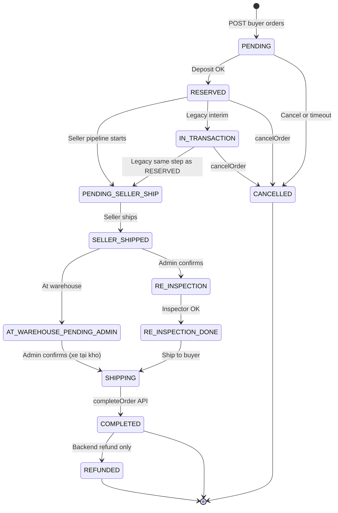
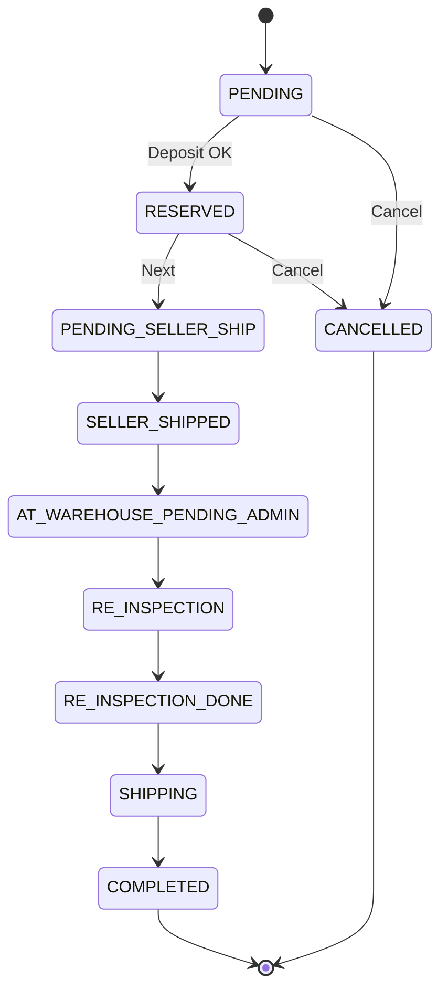
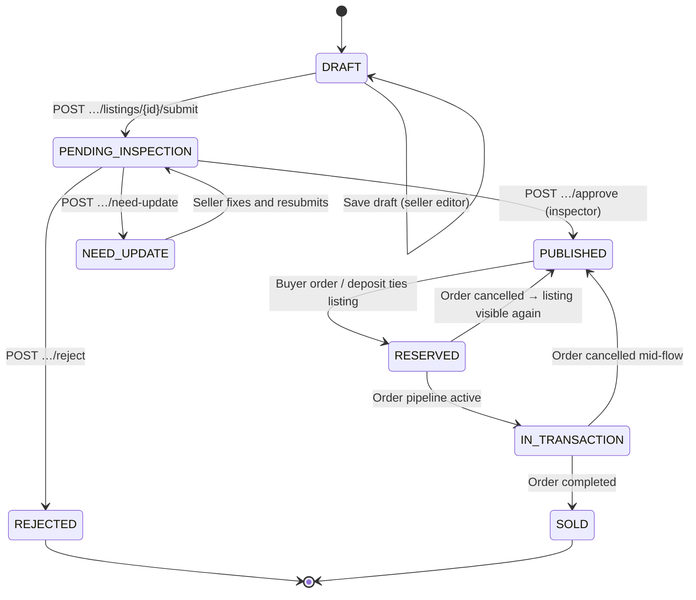
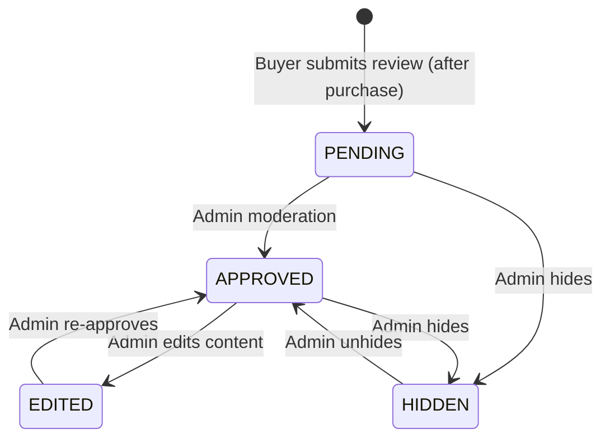
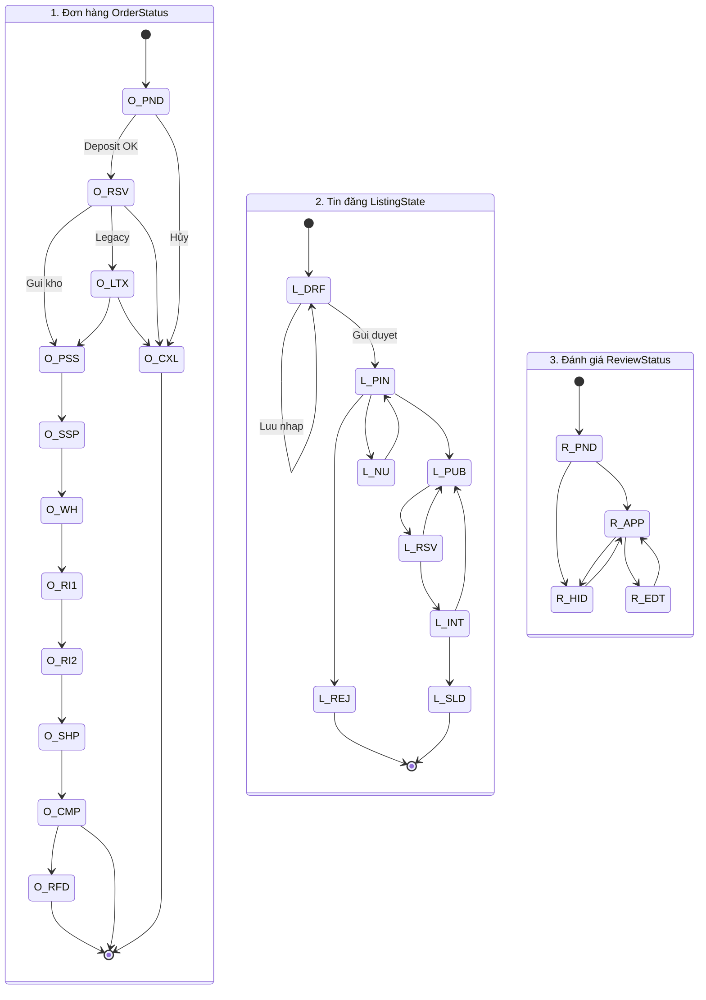

# State Transition Diagram — Drawing Guide

A **state transition diagram** shows the possible states of an entity (e.g. Order, Listing, Review) and the **allowed changes** between them. Each state is a node; each allowed change is an arrow labeled with the action/trigger.

> **Hướng dẫn vẽ từng bước:** [STATE-CHART-HUONG-DAN.md](STATE-CHART-HUONG-DAN.md) — tutorial chi tiết 9 bước cho dự án ShopBike.

---

## ShopBike — canonical Mermaid (aligned with this repo)

**Sources of truth**

| Item | Where in code / docs |
|------|----------------------|
| Order enum | `src/types/order.ts` → `OrderStatus` |
| Order progress UI order | `src/pages/TransactionPage.tsx` → `SHIPPING_FLOW_STEPS` |
| Legacy order label | Same file → `IN_TRANSACTION` mapped to step index `0` in `isStepDone` |
| Create order (mock) | `src/services/buyerService.ts` → `mockCreateOrder` returns **`RESERVED`** (no `PENDING`) |
| Cancel / complete | `cancelOrder`, `completeOrder` → `CANCELLED`, `COMPLETED` |
| Warehouse / re-inspection | `src/services/adminService.ts` → `confirmWarehouseArrival` → `RE_INSPECTION`; `submitReInspectionDone` → `SHIPPING` |
| Listing enum | `src/types/listing.ts` → `ListingState` |
| Inspector actions | `backend/README.md` § Inspector endpoints |
| Review enum | `src/types/review.ts` → `ReviewStatus` |

Mermaid **`[*]`** = UML initial / final pseudo-state.

**Why the diagram can look “dư” (messy or redundant)**

1. **Floating word boxes in Draw.io** — If you paste Mermaid into Draw.io/diagrams.net, some importers **split one arrow label** into many tiny text shapes (especially labels with `;`, `( )`, or long English). Those boxes are **import bugs**, not extra business logic. **Fix:** shorten labels (below), or draw arrows manually and type one short label per arrow; or export **SVG/PNG from [mermaid.live](https://mermaid.live)** and place the image instead of re-importing text.
2. **`IN_TRANSACTION`** — Still in `OrderStatus` and used in `BuyerProfile` / progress logic as **legacy**. For a **minimal happy-path** diagram you can **omit** this state; keep it only if you document full API compatibility.
3. **Several arrows → `CANCELLED`** — Not duplicate rules: **cancel is allowed from different states** (`PENDING`, `RESERVED`, `IN_TRANSACTION`). One end state, many valid entry transitions.

### 1) Order `status` (`OrderStatus`)

Labels kept **short** so Draw.io import is less likely to break.



*Implementation note:* `src/services/adminService.ts` mock `submitReInspectionDone` may jump from `RE_INSPECTION` straight to **`SHIPPING`**. The chain above matches **`SHIPPING_FLOW_STEPS`** in `TransactionPage.tsx` and the intended Spring Boot flow (`RE_INSPECTION_DONE` before `SHIPPING`).

### 1b) Order — minimal flow (no `IN_TRANSACTION`, for slides)



### 2) Listing `state` (`ListingState`)



### 3) Review `status` (`ReviewStatus`)



> **Tip:** [mermaid.live](https://mermaid.live) — paste to preview / export.

---

## 1. Entities and Their States

ShopBike has 3 main entities with status/state flows:

| Entity | Field | States |
|--------|-------|--------|
| **Order** | `status` | PENDING, RESERVED, PENDING_SELLER_SHIP, SELLER_SHIPPED, AT_WAREHOUSE_PENDING_ADMIN, RE_INSPECTION, RE_INSPECTION_DONE, SHIPPING, IN_TRANSACTION, COMPLETED, CANCELLED, REFUNDED |
| **Listing** | `state` | DRAFT, PENDING_INSPECTION, NEED_UPDATE, PUBLISHED, RESERVED, IN_TRANSACTION, SOLD, REJECTED |
| **Review** | `status` | PENDING, APPROVED, EDITED, HIDDEN |

---

## 2. Allowed Transitions

### 2.1 Order status transitions

| From | To | Trigger / Actor |
|------|-----|-----------------|
| (new) | PENDING | Buyer creates order (before payment) |
| PENDING | RESERVED | Buyer pays deposit successfully |
| PENDING | CANCELLED | Buyer cancels / timeout |
| RESERVED | PENDING_SELLER_SHIP | System / Seller accepts order |
| PENDING_SELLER_SHIP | SELLER_SHIPPED | Seller marks bike as shipped |
| SELLER_SHIPPED | AT_WAREHOUSE_PENDING_ADMIN | Bike arrives at warehouse (tracking) |
| AT_WAREHOUSE_PENDING_ADMIN | SHIPPING | Admin confirms (xe tại kho từ listing) |
| SELLER_SHIPPED | RE_INSPECTION | Admin confirms warehouse arrival |
| RE_INSPECTION | RE_INSPECTION_DONE | Inspector confirms re-inspection OK |
| RE_INSPECTION_DONE | SHIPPING | System moves to shipping phase |
| SHIPPING | COMPLETED | Buyer completes final payment / delivery |
| RESERVED / IN_TRANSACTION / PENDING_SELLER_SHIP | CANCELLED | Buyer cancels (chỉ khi DIRECT) |
| COMPLETED | REFUNDED | Refund issued (dispute) |

### 2.2 Listing state transitions

| From | To | Trigger / Actor |
|------|-----|-----------------|
| (new) | DRAFT | Seller creates listing |
| DRAFT | DRAFT | Seller saves draft |
| DRAFT | PENDING_INSPECTION | Seller clicks "Submit for inspection" |
| PENDING_INSPECTION | PUBLISHED | Inspector approves |
| PENDING_INSPECTION | REJECTED | Inspector rejects |
| PENDING_INSPECTION | NEED_UPDATE | Inspector requests changes |
| NEED_UPDATE | DRAFT | Seller edits (conceptually back to editable) |
| NEED_UPDATE | PENDING_INSPECTION | Seller resubmits after edit |
| PUBLISHED | RESERVED | Buyer places order (deposit paid) |
| RESERVED | PUBLISHED | Order cancelled, listing available again |
| RESERVED | IN_TRANSACTION | Order progresses |
| IN_TRANSACTION | SOLD | Order completed |
| IN_TRANSACTION | PUBLISHED | Order cancelled |

### 2.3 Review status transitions

| From | To | Trigger / Actor |
|------|-----|-----------------|
| (new) | PENDING | Buyer submits review |
| PENDING | APPROVED | Admin approves |
| PENDING | HIDDEN | Admin hides |
| APPROVED | EDITED | Admin edits content |
| APPROVED | HIDDEN | Admin hides |
| EDITED | APPROVED | Admin re-approves |
| HIDDEN | APPROVED | Admin unhides |

---

## 3. Hướng dẫn vẽ từng bước (Draw.io / giấy)

### Bước 1: Chọn công cụ

| Tool | Pros | Cons |
|------|------|------|
| **Draw.io** (diagrams.net) | Free, web + desktop, export PNG/SVG | Manual layout |
| **Mermaid** (in markdown) | Code-based, renders in GitHub/GitLab | Less flexible layout |
| **Lucidchart** | Good collaboration | Paid for advanced |
| **Pen & paper** | Fast, no setup | Hard to edit, share |
| **Excalidraw** | Hand-drawn look, simple | Less formal |

### Bước 2–4: Vẽ nodes (states)

- Draw a **rounded rectangle** for each state.
- Use **one color** for “active” states (e.g. blue) and another for terminal states (e.g. green = done, red = cancelled).
- Label each node with the exact state name (e.g. `PENDING_INSPECTION`).

### Bước 5: Vẽ mũi tên (transitions)

- Draw an **arrow** from state A to state B **only if** that transition is allowed (see tables above).
- Label each arrow with the **trigger** (e.g. “Buyer pays deposit”, “Inspector approves”).
- Optionally add the **actor** in parentheses: `(Buyer)`, `(Inspector)`, `(Admin)`.

### Bước 6: Đánh dấu start và end

- **Start**: Use a filled circle or “Start” node pointing to the initial state(s) (e.g. `DRAFT`, `PENDING`).
- **End**: Terminal states (e.g. `COMPLETED`, `CANCELLED`, `SOLD`, `REJECTED`) have no outgoing arrows (or only to REFUNDED in special cases).

### Bước 7: Tô màu / legend (tùy chọn)

- Define shapes: `[ ]` = state, `( )` = start/end.
- Define colors: e.g. blue = in progress, green = success, red = failure.

---

## 4. Copy-paste diagrams

Dùng **3 khối Mermaid** trong **§ ShopBike — canonical Mermaid** ở trên.

### 4b) Gộp 1 sơ đồ (Order + Listing + Review)



Tiền tố: `O_` = Order, `L_` = Listing, `R_` = Review (tránh trùng tên state).

---

## 5. Checklist for Your Diagram

- [ ] All states from the tables are shown as nodes
- [ ] Every arrow matches an allowed transition in the tables
- [ ] No arrow from state A to B if that transition is not allowed
- [ ] Start node points to initial state(s)
- [ ] Terminal states (COMPLETED, CANCELLED, SOLD, REJECTED, etc.) are clearly marked
- [ ] Arrows are labeled with trigger and optionally actor
- [ ] Legend or color scheme is added if useful

---

## 6. Quick Reference: Order Flow (Simplified)

For a high-level diagram, you can simplify Order to:

```
PENDING → RESERVED → PENDING_SELLER_SHIP → SELLER_SHIPPED → AT_WAREHOUSE → RE_INSPECTION → RE_INSPECTION_DONE → SHIPPING → COMPLETED
    │           │
    └───────────┴────────────────────────────────────────────────────────────────────────────────────────────→ CANCELLED
```

---

## 7. Tools & Links

- **Draw.io**: [app.diagrams.net](https://app.diagrams.net)
- **Mermaid Live Editor**: [mermaid.live](https://mermaid.live)
- **Excalidraw**: [excalidraw.com](https://excalidraw.com)
