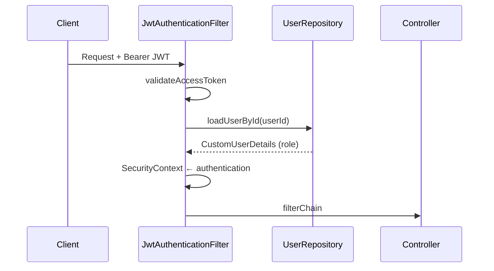
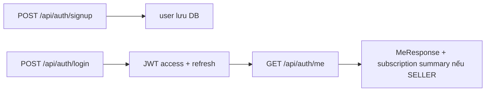
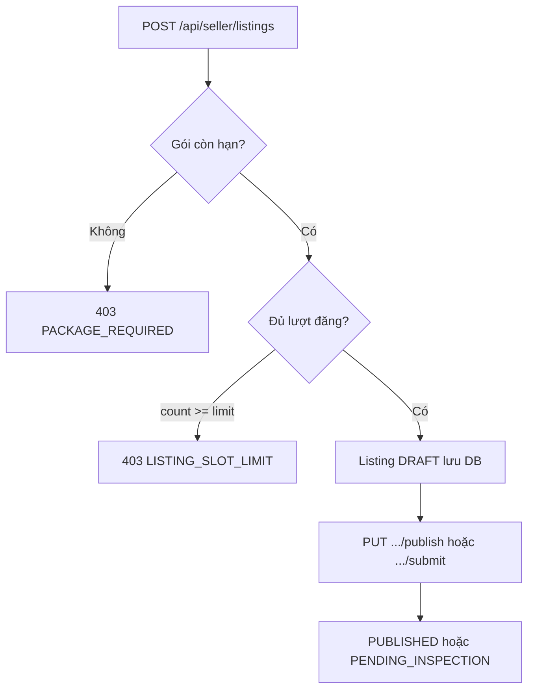
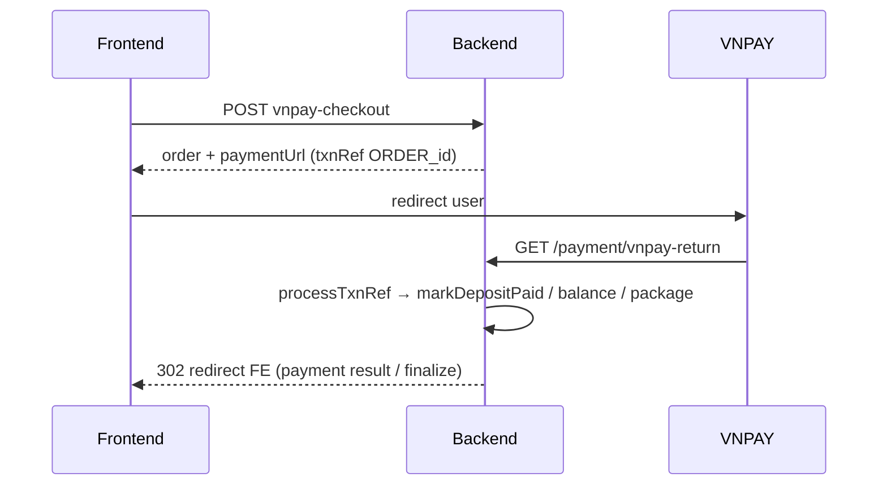

# Kiến trúc backend `quydu_be` — cấu trúc dự án và luồng nghiệp vụ

Tài liệu mô tả **cấu trúc package**, **bảo mật**, **chuẩn API**, **bảng dữ liệu**, và **các flow chính** (auth, seller, buyer + VNPAY, inspector, admin, payment). Dùng kèm [BACKEND-LOCAL-SETUP.md](BACKEND-LOCAL-SETUP.md), [PAYMENTS-VNPAY.md](PAYMENTS-VNPAY.md), [FRONTEND-INTEGRATION.md](FRONTEND-INTEGRATION.md).

---

## 1. Công nghệ và vận hành

| Thành phần | Ghi chú |
|------------|---------|
| Java / Spring Boot 3 | REST, validation, transaction |
| Spring Security | JWT stateless, `@PreAuthorize` |
| Spring Data JPA + Hibernate | `ddl-auto` thường là `update` (local) |
| MySQL | Schema ví dụ: `quydu_db` |
| springdoc / Swagger | `http://localhost:8081/swagger-ui/index.html` |
| Profile mặc định | `spring.profiles.default=local` — nạp `application-local.properties` nếu có |

**Cổng mặc định:** `8081`. **CORS:** `application.properties` → `app.cors.allowed-origins` (Vite `5173`).

---

## 2. Cấu trúc thư mục mã nguồn

```
src/main/java/com/minhyun/quydu_be/
├── QuyduBeApplication.java      # Entry point
├── config/                      # Security, OpenAPI, DataSeeder, bootstrap local
├── controller/                  # REST: pathPrefix → service
├── dto/                         # request/response, ApiResponse helpers
├── entity/                      # JPA entities + enum (User, Listing, Order, …)
├── exception/                   # BadRequest, Forbidden, + GlobalExceptionHandler
├── repository/                  # Spring Data JPA
├── security/                    # JWT filter, UserDetails, JwtTokenProvider
├── service/                     # Interface
├── service/impl/                # Triển khai nghiệp vụ
├── subscription/                # Hằng số quota gói (Basic/VIP)
├── util/                        # SecurityUtils, serializers
└── web/                         # RestResponses (envelope JSON)

src/main/resources/
├── application.properties
├── application-local.properties   # .gitignore — secret MySQL, JWT, VNPAY
└── application-local.properties.example
```

**Nguyên tắc:** Controller mỏng; rule nghiệp vụ nằm trong `*ServiceImpl`. Truy vấn DB trong `*Repository`.

---

## 3. Bảo mật (JWT)

### 3.1 Ai được gọi API không cần token

- `POST/GET …` `/api/auth/**` (đăng ký, đăng nhập, refresh, …)
- `GET /api/health/**`
- `GET /api/bikes/**`, `GET /api/brands/**`, `GET /api/packages/**` (marketplace + catalog)
- `GET /uploads/**` (ảnh đã upload)
- **`/payment/**`** — redirect VNPAY, IPN (không dùng Bearer)

Mọi route khác: **bắt buộc** header `Authorization: Bearer <access_token>`.

### 3.2 Role và `@PreAuthorize`

| Prefix controller | Role (Spring `hasRole`) |
|-------------------|-------------------------|
| `/api/seller/**` | `SELLER` hoặc `ADMIN` |
| `/api/buyer/**` | `BUYER` hoặc `ADMIN` |
| `/api/admin/**` | `ADMIN` |
| `/api/inspector/**` | `INSPECTOR` hoặc `ADMIN` |

**Quan trọng:** Role thực tế được nạp từ **DB theo `userId` trong JWT**, không phải theo nhãn hiển thị trên FE. Nếu login seller mà gọi `/api/buyer/orders/vnpay-checkout` sẽ **403** (xem message trong `SecurityConfig`).

### 3.3 Luồng xác thực



---

## 4. Chuẩn envelope JSON (RestResponses)

| Phương thức | Body | HTTP |
|-------------|------|------|
| `okData(x)` | `{ "data": x }` | 200 |
| `createdData(x)` | `{ "data": x }` | 201 |
| `okContent(list)` | `{ "content": list }` | 200 |

FE ShopBike/quydu12 thường đọc `data` hoặc `content` tùy endpoint (ví dụ danh sách xe: `content`).

---

## 5. Model dữ liệu (MySQL)

Các bảng chính (tên bảng JPA):

| Bảng | Vai trò |
|------|---------|
| `users` | Người dùng, `role`, gói `subscription_plan`, `subscription_expires_at` |
| `listings` | Tin đăng xe, `seller_id`, `state`, `is_hidden`, giá, ảnh (element collection → `listing_images`) |
| `listing_images` | `listing_id` + `image_url` |
| `orders` | Đơn mua: `buyer_id`, `listing_id`, `status`, `fulfillment_type`, VNPAY fields |
| `reviews` | Đánh giá sau khi đơn `COMPLETED` |
| `package_orders` | Đơn mua gói đăng tin (VNPAY `PACKAGE_*`) |
| `brands` | Danh mục brand (admin CRUD + seed) |

Xóa dữ liệu local (tin + đơn + review): xem [sql/local-reset-all-listings.sql](sql/local-reset-all-listings.sql).

---

## 6. Enum nghiệp vụ

### 6.1 `ListingState` (tin đăng)

`DRAFT` → (seller publish) → `PUBLISHED` hoặc `PENDING_INSPECTION`  
`PENDING_INSPECTION` → (inspector) → `AWAITING_WAREHOUSE` | `REJECTED` | `NEED_UPDATE`  
`AWAITING_WAREHOUSE` → (seller) → `AT_WAREHOUSE_PENDING_VERIFY`  
Warehouse / chứng nhận: `AT_WAREHOUSE_PENDING_VERIFY`, `AT_WAREHOUSE_PENDING_RE_INSPECTION`, `NEED_UPDATE`  
Marketplace: `PUBLISHED`, `RESERVED`, `IN_TRANSACTION`, `SOLD`, `REJECTED`

### 6.2 `OrderStatus` (đơn hàng)

Luồng tóm tắt: `RESERVED` → (sau VNPAY cọc) `PENDING_SELLER_SHIP` → … → `SHIPPING` → buyer `complete` → `COMPLETED` (+ listing `SOLD`).  
Chi nhánh **kho** (`WAREHOUSE`): có `SELLER_SHIPPED`, `AT_WAREHOUSE_PENDING_ADMIN`, `RE_INSPECTION`, `RE_INSPECTION_DONE`, …

### 6.3 `OrderFulfillmentType`

- `DIRECT`: seller giao thẳng cho buyer (xe không kiểm định / certified theo rule trong code).
- `WAREHOUSE`: sau kiểm định, xe đi qua kho và admin/inspector xử lý thêm bước xác nhận.

---

## 7. Luồng Auth



**Subscription summary (trong `data`):** `plan`, `expiresAt`, `active`, `publishedSlotsUsed`, `publishedSlotsLimit`, `listingDurationDays`.  
- **Đã dùng:** đếm `listings` của seller có `hidden = false`, **trừ** `REJECTED` (tin từ chối kiểm định không trừ lượt). Các trạng thái khác kể cả `SOLD` vẫn tính.  
- **Giới hạn:** `SubscriptionPostingQuota` — Basic **3**, VIP **20** (có thể đổi trong code).

**Lưu ý:** `GET /api/packages` trả `maxConcurrentListings` trong catalog tĩnh; **quota thật** khi tạo tin / hiển thị trong `/me` lấy từ `SubscriptionPostingQuota`, nên dev cần đồng bộ copy FE với BE nếu đổi số.

---

## 8. Luồng Seller — tin đăng và gói

### 8.1 Tạo và đăng tin



- **Upload ảnh:** `POST /api/seller/listings/upload-images` → URL dạng `{app.public-base-url}/uploads/listings/...`.
- **Kiểm định:** chỉ gói **VIP** được gửi tin `PUBLISHED` kèm `requestInspection` hoặc `PUT .../submit` (xem `SellerServiceImpl`).
- **Quota:** kiểm tra tại **`createListing`**, không chặn lại lúc publish (mỗi tin đã tạo = 1 lượt).

### 8.2 Gói đăng tin (VNPAY + sandbox)

- `POST /api/seller/subscription/checkout` tạo `package_orders` + URL VNPAY; trong code demo sandbox còn **kích hoạt gói ngay** để test (xem `SellerServiceImpl.checkoutSubscription`).
- Sau thanh toán, VNPAY redirect **`GET /payment/vnpay-return`** với `vnp_TxnRef` dạng `PACKAGE_{id}` → xử lý `markPackagePaid`, cập nhật user.

**Tắt seed tin demo:** `application-local.properties` → `app.seed-demo-listing=false` (tránh sau khi TRUNCATE lại xuất hiện “Trek Emonda…”). Xem `DataSeeder`.

---

## 9. Luồng Marketplace (public)

- `GET /api/bikes` → `content`: danh sách tin **PUBLISHED**, không ẩn, chưa hết hạn (`listing_expires_at`).
- `GET /api/bikes/{id}` → `data`: chi tiết một tin.

---

## 10. Luồng Buyer — đặt mua và VNPAY

### 10.1 Tạo đơn (bắt buộc VNPAY checkout)

- **`POST /api/buyer/orders`** trả lỗi hướng dẫn dùng **`POST /api/buyer/orders/vnpay-checkout`**.
- Request: `listingId`, `plan` (`DEPOSIT` | `FULL`), địa chỉ giao hàng, …
- Cọc: **8%** giá, làm tròn VND; `FULL` = toàn bộ giá (làm tròn).
- Điều kiện listing: `PUBLISHED`, không ẩn, chưa hết hạn; tạo **Order** `RESERVED`, listing → `RESERVED`, hết hạn giữ chỗ 24h (logic hết hạn trong `BuyerServiceImpl`).

### 10.2 Thanh toán VNPAY



- **`POST /payment/create`** với body `{"orderId": n}` — tạo URL thanh toán cho bước còn lại (không dùng GET trên browser).
- **Cọc xong:** `markDepositPaid` → **`PENDING_SELLER_SHIP`** nếu **DIRECT**; **`AT_WAREHOUSE_PENDING_ADMIN`** nếu **WAREHOUSE** (xe kiểm định — buyer theo dõi theo trạng thái kho trên FE).
- **Số dư (DEPOSIT):** `BALANCE_{orderId}`, `payBalanceVnpay`.

### 10.3 Sau mua

- **Hoàn tất nhận xe:** `PUT /api/buyer/orders/{id}/complete` (khi order **`SHIPPING`**).
- **Hủy:** `PUT .../cancel` trong nhóm trạng thái được phép → listing về **`PUBLISHED`**.
- **Review:** `POST .../orders/{id}/review` khi order **`COMPLETED`**.

### 10.4 Transaction screen

- `GET /api/buyer/orders/by-listing/{listingId}` hoặc alias `GET /api/buyer/transactions/{listingId}` với query `orderId` tùy chọn.

---

## 11. Luồng Inspector

- `GET /api/inspector/pending-listings` — `PENDING_INSPECTION`.
- **Duyệt:** `PUT .../approve` → listing `AWAITING_WAREHOUSE`, `certificationStatus` cập nhật (kèm báo cáo điểm nếu body đủ).
- **Từ chối:** `PUT .../reject` với body JSON `{"reason":"..."}` (bắt buộc, tối đa 1000 ký tự lưu vào `inspectionNeedUpdateReason`) → `REJECTED` (không tính vào lượt đăng).
- **Cần cập nhật:** `.../need-update` → `NEED_UPDATE` + lý do.

---

## 12. Luồng Admin (kho, user, review, brand)

- **Kho / đơn:** `listWarehousePending`, `confirmWarehouse` (chuyển trạng thái order theo `SELLER_SHIPPED` / `AT_WAREHOUSE_PENDING_ADMIN`), `re-inspection` endpoints.
- **Listing kho:** `confirmWarehouseIntake`, `confirmWarehouseReInspection` (action NEED_UPDATE / publish lại tùy logic).
- **User:** ẩn/hiện, thu hồi subscription seller.
- **Review:** danh sách + cập nhật moderation.
- **Brand:** CRUD.

Một số endpoint admin cho phép thêm role **INSPECTOR** (xem annotation trên `AdminController`).

---

## 13. Luồng Seller — đơn hàng của mình

- `GET /api/seller/orders`
- **Giao trực tiếp:** `PUT .../orders/{id}/ship-to-buyer` (khi `PENDING_SELLER_SHIP` và `DIRECT`).
- **Qua kho:** `PUT .../ship-to-warehouse`; listing đang chờ kho: `PUT .../listings/{id}/mark-shipped-to-warehouse`.

Chi tiết điều kiện trạng thái nằm trong `SellerServiceImpl` / `AdminServiceImpl` / `BuyerServiceImpl`.

---

## 14. Xử lý lỗi

- `GlobalExceptionHandler` chuẩn hóa JSON lỗi (thời gian, status, message, path).
- Mã message thường gặp: `PACKAGE_REQUIRED`, `LISTING_SLOT_LIMIT`, `VIP_REQUIRED_FOR_INSPECTION`, `USE_VNPAY_CHECKOUT`, …

---

## 15. Tài liệu liên quan trong repo

| File | Nội dung |
|------|----------|
| [BACKEND-LOCAL-SETUP.md](BACKEND-LOCAL-SETUP.md) | Chạy local, MySQL, profile |
| [PAYMENTS-VNPAY.md](PAYMENTS-VNPAY.md) | Sandbox, thẻ test |
| [FRONTEND-INTEGRATION.md](FRONTEND-INTEGRATION.md) | Vite, CORS, base URL |
| [FE-API-PARITY.md](FE-API-PARITY.md) | Đối chiếu FE |
| [sql/local-reset-all-listings.sql](sql/local-reset-all-listings.sql) | Dọn tin/đơn/review local |

---

## 16. Gợi ý đọc code theo chủ đề

| Chủ đề | Class chính |
|--------|-------------|
| Auth + Me | `AuthController`, `AuthServiceImpl`, `JwtTokenProvider` |
| Seller | `SellerController`, `SellerServiceImpl` |
| Buyer + Order | `BuyerController`, `BuyerServiceImpl` |
| Thanh toán | `PaymentController`, `VnpayUrlService` |
| Admin | `AdminController`, `AdminServiceImpl` |
| Inspector | `InspectorController`, `InspectorServiceImpl` |
| Public catalog | `BikeController`, `BikeService` |
| Gói tin (catalog JSON) | `PackageController`, `PackageServiceImpl` |
| Quota | `SubscriptionPostingQuota`, `ListingRepository.countOccupyingPostingSlots(..., REJECTED)` |

Khi chỉnh rule nghiệp vụ, ưu tiên tìm trong `*ServiceImpl` tương ứng trước khi sửa controller.
