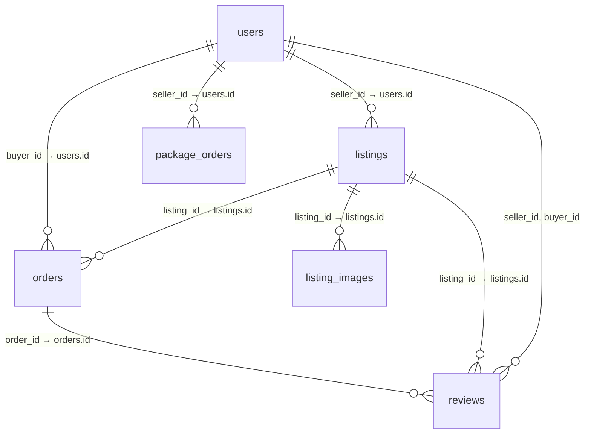

# Phân tích database: khóa chính, khóa ngoại và quan hệ 1–n (ShopBike / quydu_be)

Tài liệu dùng cho **hội đồng / báo cáo**: giải thích cách **khóa chính (PK)** và **khóa ngoại (FK)** liên kết các bảng, và **quan hệ một–nhiều (1–N)** trong hệ thống.

Nguồn thiết kế: **JPA Entity** trong `src/main/java/com/minhyun/quydu_be/entity/`. Trên MySQL, Hibernate thường tạo cột FK tương ứng; có thể kiểm tra bằng `SHOW CREATE TABLE tên_bảng;` hoặc `INFORMATION_SCHEMA.KEY_COLUMN_USAGE`.

---

## 1. Quy ước khóa chính

Hầu hết bảng nghiệp vụ kế thừa `BaseEntity`:

| Cột | Ý nghĩa |
|-----|--------|
| `id` | **PK**, kiểu số tăng tự động (`IDENTITY`), duy nhất toàn bảng |
| `created_at` | Thời điểm tạo bản ghi |
| `updated_at` | Thời điểm cập nhật cuối |

**Vai trò:** Mỗi “thực thể” (user, tin đăng, đơn hàng, …) có **một định danh nội bộ** ổn định, không phụ thuộc email hay tiêu đề tin — thuận API REST (`/orders/{id}`), join và khóa ngoại.

---

## 2. Khóa ngoại: nguyên tắc hoạt động

- **Khóa ngoại (FK)** là (các) cột ở **bảng con** trỏ tới **khóa chính** ở **bảng cha**.
- Ý nghĩa nghiệp vụ: “Bản ghi con **thuộc về** một bản ghi cha cụ thể” (ví dụ một tin **thuộc** một seller).
- **Toàn vẹn tham chiếu:** DB (hoặc ORM khi cấu hình `ON DELETE`/`ON UPDATE`) đảm bảo không thể chèn `seller_id = 999` nếu không có `users.id = 999` (trừ khi tắt FK — không khuyến nghị production).

Trong đồ án, phần “**một**” thường là thực thể **ít thay đổi số lượng theo chiều “sở hữu**” (một user), phần “**nhiều**” là các bản ghi sinh ra theo thời gian (nhiều tin, nhiều đơn).

---

## 3. Sơ đồ quan hệ tổng quát (logic)



*(Lưu ý: `listing_images` trong code là `@ElementCollection` — mỗi dòng một URL, FK `listing_id`.)*

---

## 4. Chi tiết từng bảng: PK và FK

### 4.1. `users` (bảng **users**)

| Khóa | Cột | Ghi chú |
|------|-----|--------|
| **PK** | `id` | Người dùng (buyer / seller / inspector / admin) |

**Không** có FK sang bảng khác trong entity `User` — đây thường là **bảng gốc** của nhiều quan hệ 1–N (phía “một”).

---

### 4.2. `listings` (tin đăng)

| Khóa | Cột | Trỏ tới |
|------|-----|--------|
| **PK** | `id` | |
| **FK** | `seller_id` **→** `users.id` | Tin **thuộc** một seller |

**Quan hệ 1–N:** Một **user** (role SELLER) có **nhiều** **listings**. Chiều ngược: mỗi **listing** có **đúng một** seller (`seller_id` NOT NULL).

---

### 4.3. `orders` (đơn hàng / giao dịch mua)

| Khóa | Cột | Trỏ tới |
|------|-----|--------|
| **PK** | `id` | |
| **FK** | `buyer_id` **→** `users.id` | Người mua |
| **FK** | `listing_id` **→** `listings.id` | Tin được đặt mua |

Cột địa chỉ giao (`shipping_street`, …) là **embedded** — nằm **cùng bảng** `orders`, không tạo bảng `shipping_addresses` riêng.

**Quan hệ 1–N (hai chiều từ thực thể trung tâm):**

- Một **buyer** (`users`) có **nhiều** **orders** (`buyer_id`).
- Một **listing** có thể có **nhiều** **orders** theo thời gian (nhiều lượt đặt/lịch sử — tùy nghiệp vụ; trong thực tế thường giới hạn một đơn “đang active” cho một tin, nhưng **mô hình DB** vẫn là 1 listing : N orders).

---

### 4.4. `package_orders` (đơn mua **gói đăng tin**)

| Khóa | Cột | Trỏ tới |
|------|-----|--------|
| **PK** | `id` | |
| **FK** | `seller_id` **→** `users.id` | Seller **mua gói** |

**Quan hệ 1–N:** Một **seller** có **nhiều** lịch sử **package_orders** (nhiều lần thanh toán / gia hạn).

---

### 4.5. `listing_images` (ảnh của tin)

Không phải entity `@Entity` riêng; là bảng phụ của `@ElementCollection` trên `Listing`:

| Khóa | Cột | Trỏ tới |
|------|-----|--------|
| (logic) | `listing_id` **→** `listings.id` | Một tin có nhiều URL ảnh |

**Quan hệ 1–N:** Một **listing** — **nhiều** dòng ảnh (mỗi dòng một `image_url`).

---

### 4.6. `reviews` (đánh giá sau mua)

| Khóa | Cột | Trỏ tới |
|------|-----|--------|
| **PK** | `id` | |
| **FK** | `order_id` **→** `orders.id` | Gắn với đơn đã hoàn thành |
| **FK** | `listing_id` **→** `listings.id` | Tin được đánh giá |
| **FK** | `seller_id` **→** `users.id` | Người bán |
| **FK** | `buyer_id` **→** `users.id` | Người mua |

**Quan hệ 1–N:**

- Một **order** (nếu nghiệp vụ chỉ cho một review / hoặc nhiều theo rule) — thường trình bày: **một đơn hoàn thành** tạo **một** (hoặc **nhiều** tùy rule) **review**.
- Một **listing** có **nhiều** **reviews** (theo thời gian, nhiều buyer khác nhau).
- Một **seller** / **buyer** có **nhiều** **reviews** (qua các đơn khác nhau).

*Ghi chú hội đồng:* Lưu đồng thời `order_id` và `listing_id` là **dư thừa có chủ đích** (denormalization): truy vấn thống kê review theo listing/seller nhanh, không bắt buộc join qua order mỗi lần; điều kiện là **khi tạo review** ứng dụng phải **khớp** `listing`/`seller` với `order`.

---

### 4.7. `brands` (thương hiệu — nếu dùng danh mục)

Entity `Brand` có PK `id`; **không** có FK từ `Listing` entity trong grep trước đó — `Listing` lưu `brand` dạng chuỗi. Có thể trình bày: **danh mục brand** độc lập với tin; tin tham chiếu **tên** brand, hoặc sau này chuẩn hóa FK `brand_id` — **đúng với code hiện tại** là quan hệ **lỏng** (text), không bắt buộc 1–N trong DB cho listing–brand.

*(Cập nhật nếu sau này team thêm `brand_id` vào `listings`.)*

---

## 5. Tóm tắt quan hệ **một–nhiều** (để nói trước hội đồng)

| Một (1) | Nhiều (N) | Cột FK phía N |
|---------|------------|----------------|
| `users` (seller) | `listings` | `seller_id` |
| `users` (buyer) | `orders` | `buyer_id` |
| `listings` | `orders` | `listing_id` |
| `users` (seller) | `package_orders` | `seller_id` |
| `listings` | `listing_images` | `listing_id` |
| `orders` | `reviews` | `order_id` |
| `listings` | `reviews` | `listing_id` |
| `users` (seller/buyer) | `reviews` | `seller_id`, `buyer_id` |

Chiều **ngược** mỗi dòng: mỗi bản ghi ở cột **N** chỉ trỏ **một** bản ghi ở cột **1** (giá trị FK đơn).

---

## 6. Không có quan hệ “nhiều–nhiều” (N–N) tách bảng trong phạm vi chính

- **Users ↔ Listings** không phải N–N: tin **luôn** có một `seller_id`.
- **Listing images** là **1–N** (một bảng phụ `listing_images`), không cần bảng trung gian kiểu `listing_image_link` với hai PK phức hợp — mô hình đơn giản đủ dùng.

---

## 7. Câu SQL kiểm tra FK (minh họa khi hội đồng hỏi “chứng minh trong MySQL”)

```sql
SELECT TABLE_NAME,
       COLUMN_NAME,
       REFERENCED_TABLE_NAME,
       REFERENCED_COLUMN_NAME
FROM INFORMATION_SCHEMA.KEY_COLUMN_USAGE
WHERE TABLE_SCHEMA = DATABASE()
  AND REFERENCED_TABLE_NAME IS NOT NULL
ORDER BY TABLE_NAME, COLUMN_NAME;
```

---

## 8. Kết luận ngắn

- **PK** `id` định danh từng bản ghi; **FK** đảm bảo **tin thuộc seller**, **đơn thuộc buyer + listing**, **gói thuộc seller**, **review gắn order + listing + hai phía**.
- Mô hình chủ yếu là **1–N** từ `users` và `listings` ra các bảng giao dịch và phụ trợ — phù hợp sàn: nhiều tin/người, nhiều đơn/tin và nhiều đơn/người mua.

File truy vấn mẫu theo luồng nghiệp vụ: `docs/sql/ALL-FLOWS-BY-ROLE.sql`.
