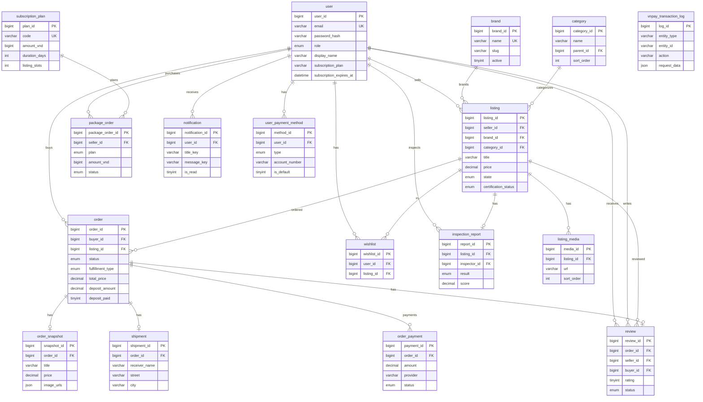

# Hướng dẫn: Mermaid, Draw.io, tạo bảng MySQL — ShopBike ERD

---

## 1. Code Mermaid (copy-paste)

Copy đoạn sau vào [mermaid.live](https://mermaid.live) hoặc file `.mmd`:



**Xuất ảnh từ Mermaid Live:** Generate → PNG hoặc SVG → tải về.

---

## 2. Hướng dẫn vẽ trên Draw.io (diagrams.net)

### Cách A: Import Mermaid (nếu Draw.io hỗ trợ)

1. Mở [draw.io](https://app.diagrams.net/) hoặc [diagrams.net](https://www.diagrams.net/)
2. **Arrange** → **Insert** → **Advanced** → **Mermaid**
3. Dán toàn bộ code Mermaid (phần `erDiagram` đến `}`) → **Insert**
4. Sơ đồ có thể bị tách nhiều shape — chỉnh layout thủ công nếu cần.

### Cách B: Vẽ thủ công (chuẩn Chen / Crow’s Foot)

#### Bước 1: Tạo Entity (bảng)

Với mỗi bảng, tạo **1 hình chữ nhật** với:
- **Tên bảng** (ví dụ: `user`, `listing`)
- **Cột (thuộc tính)** — gạch dưới PK, ghi FK nếu có

**Thứ tự vẽ đề xuất** (tránh FK chưa có bảng):
1. `user` 2. `brand` 3. `category` 4. `subscription_plan`
5. `listing` 6. `listing_media` 7. `inspection_report`
8. `order` 9. `order_snapshot` 10. `shipment` 11. `order_payment`
12. `review` 13. `package_order` 14. `user_payment_method`
15. `wishlist` 16. `notification` 17. `vnpay_transaction_log`

#### Bước 2: Quan hệ (Relationship)

Dùng **connector** nối 2 entity. Ghi **cardinality**:
- **1:1** — một gạch `|` mỗi đầu
- **1:N** — một đầu `|`, đầu kia `o{` (một hoặc nhiều)
- **N:M** — hai đầu `o{` (ít dùng ở đây)

**Cardinality trong Draw.io:**
- Chuột phải connector → **Edit Style** → thêm `startArrow=classic`, `endArrow=classic`
- Hoặc dùng shape **Entity Relation** từ thư viện

#### Bước 3: Bảng tham chiếu nhanh — Entity & thuộc tính

| Entity | PK | Thuộc tính chính |
|--------|-----|------------------|
| user | user_id | email, password_hash, role, display_name, subscription_plan |
| brand | brand_id | name, slug, active |
| category | category_id | name, parent_id FK |
| listing | listing_id | seller_id FK, brand_id FK, category_id FK, title, price, state |
| listing_media | media_id | listing_id FK, url, sort_order |
| inspection_report | report_id | listing_id FK, inspector_id FK, result, score |
| order | order_id | buyer_id FK, listing_id FK, status, total_price, deposit_amount |
| order_snapshot | snapshot_id | order_id FK, title, price |
| shipment | shipment_id | order_id FK, receiver_name, street, city |
| order_payment | payment_id | order_id FK, amount, provider, status |
| review | review_id | order_id FK, seller_id FK, buyer_id FK, rating |
| subscription_plan | plan_id | code, amount_vnd, duration_days |
| package_order | package_order_id | seller_id FK, plan, amount_vnd, status |
| user_payment_method | method_id | user_id FK, type, account_number, is_default |
| wishlist | wishlist_id | user_id FK, listing_id FK |
| notification | notification_id | user_id FK, title_key, message_key, is_read |
| vnpay_transaction_log | log_id | entity_type, entity_id, action |

#### Bước 4: Bảng quan hệ — Nối cạnh nào

| Từ | Đến | Cardinality | Ghi chú |
|----|-----|-------------|---------|
| user | listing | 1:N | sells |
| user | order | 1:N | buys |
| user | package_order | 1:N | purchases |
| user | review | 1:N | receives, writes |
| user | wishlist | 1:N | has |
| user | notification | 1:N | receives |
| user | user_payment_method | 1:N | has |
| user | inspection_report | 1:N | inspects |
| brand | listing | 1:N | brands |
| category | listing | 1:N | categorizes |
| listing | listing_media | 1:N | has |
| listing | inspection_report | 1:1 | has |
| listing | order | 1:N | ordered |
| listing | review | 1:N | reviewed |
| listing | wishlist | 1:N | in |
| order | order_snapshot | 1:1 | has |
| order | shipment | 1:1 | has |
| order | order_payment | 1:N | payments |
| order | review | 1:1 | has |
| subscription_plan | package_order | 1:N | plans |

---

## 3. Tạo bảng trong MySQL

### Bước 1: Cài MySQL (nếu chưa có)

- **Windows:** [MySQL Installer](https://dev.mysql.com/downloads/installer/)
- **Mac:** `brew install mysql`
- **Ubuntu:** `sudo apt install mysql-server`

### Bước 2: Tạo database

```bash
mysql -u root -p -e "CREATE DATABASE IF NOT EXISTS shopbike CHARACTER SET utf8mb4 COLLATE utf8mb4_unicode_ci;"
```

Nhập mật khẩu `root` khi được hỏi.

### Bước 3: Chạy file SQL

**Từ thư mục gốc project** (chỗ có `package.json`):

```bash
mysql -u root -p shopbike < docs/sql/shopbike_mysql_schema.sql
```

Hoặc dùng đường dẫn tuyệt đối:

```bash
mysql -u root -p shopbike < C:/SWP/frontend/docs/sql/shopbike_mysql_schema.sql
```

### Bước 4: Kiểm tra

```bash
mysql -u root -p shopbike -e "SHOW TABLES;"
```

Kết quả mong đợi: 17 bảng

```
+--------------------+
| Tables_in_shopbike  |
+--------------------+
| brand              |
| category           |
| inspection_report  |
| listing            |
| listing_media      |
| notification       |
| order              |
| order_payment      |
| order_snapshot     |
| package_order      |
| shipment           |
| review             |
| subscription_plan  |
| user               |
| user_payment_method|
| vnpay_transaction_log|
| wishlist           |
+--------------------+
```

### Dùng client đồ họa (khuyến nghị)

| Công cụ | Cách dùng |
|---------|-----------|
| **MySQL Workbench** | File → Open SQL Script → chọn `shopbike_mysql_schema.sql` → Execute (⚡) |
| **DBeaver** | Kết nối MySQL → right-click database → SQL Editor → paste nội dung file → Execute |
| **phpMyAdmin** | Chọn database `shopbike` → tab SQL → paste nội dung file → Go |

**File:** `docs/sql/shopbike_mysql_schema.sql`

---

## 4. File tham chiếu

| File | Nội dung |
|------|----------|
| [ERD-MYSQL.md](ERD-MYSQL.md) | Thiết kế 17 bảng, quan hệ |
| [sql/shopbike_mysql_schema.sql](sql/shopbike_mysql_schema.sql) | CREATE TABLE đầy đủ |
