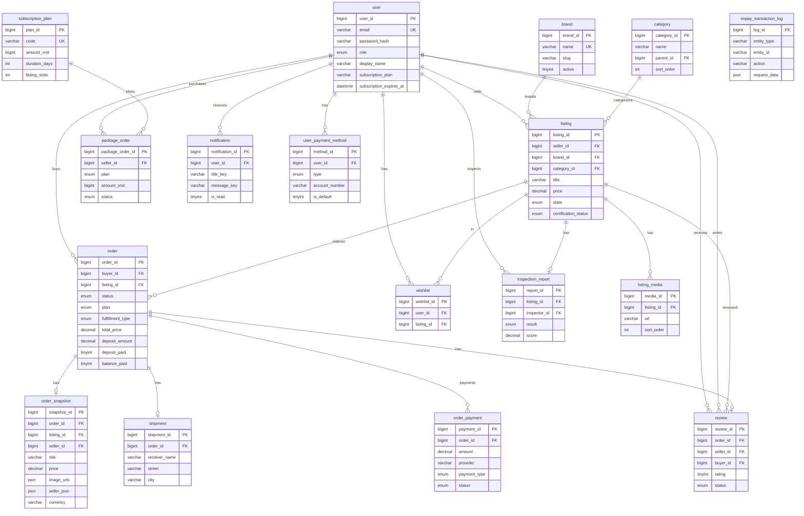

# Thiết kế Database MySQL — ShopBike

> Tài liệu hướng dẫn thiết kế database MySQL cho dự án ShopBike, gồm **17 bảng** và sơ đồ ERD.

**File SQL:** [docs/sql/shopbike_mysql_schema.sql](sql/shopbike_mysql_schema.sql)  
**Hướng dẫn Mermaid + Draw.io + MySQL:** [docs/ERD-HUONG-DAN.md](ERD-HUONG-DAN.md)  
**File Mermaid (.mmd):** [docs/sql/shopbike_erd.mmd](sql/shopbike_erd.mmd) — mở tại [mermaid.live](https://mermaid.live)

---

## 1. Tổng quan 17 bảng

| # | Bảng | Mô tả |
|---|------|-------|
| 1 | `user` | Người dùng (Buyer, Seller, Inspector, Admin) |
| 2 | `brand` | Thương hiệu xe đạp |
| 3 | `category` | Danh mục xe (Road, Mountain, …) |
| 4 | `listing` | Tin đăng xe |
| 5 | `listing_media` | Ảnh tin đăng |
| 6 | `inspection_report` | Báo cáo kiểm định |
| 7 | `order` | Đơn mua xe (buyer) |
| 8 | `order_snapshot` | Snapshot tin lúc mua (Finalize dùng) |
| 9 | `shipment` | Thông tin giao hàng |
| 10 | `order_payment` | Thanh toán đơn (VNPay) |
| 11 | `review` | Đánh giá sau giao dịch |
| 12 | `subscription_plan` | Catalog gói đăng tin |
| 13 | `package_order` | Đơn mua gói (seller) |
| 14 | `user_payment_method` | Phương thức thanh toán seller |
| 15 | `wishlist` | Danh sách yêu thích |
| 16 | `notification` | Thông báo in-app |
| 17 | `vnpay_transaction_log` | Log VNPay (audit) |

---

## 2. Sơ đồ ERD (Mermaid)

Xem tại [mermaid.live](https://mermaid.live) hoặc Cursor/VSCode với extension Mermaid.



---

## 3. Quan hệ chính

| Quan hệ | Loại | Ghi chú |
|---------|------|---------|
| user → listing | 1:N | Seller đăng tin |
| user → order | 1:N | Buyer mua hàng |
| user → package_order | 1:N | Seller mua gói |
| brand → listing | 1:N | Listing thuộc brand |
| category → listing | 1:N | Listing thuộc danh mục |
| listing → listing_media | 1:N | Một tin nhiều ảnh |
| listing → inspection_report | 1:1 | Một tin một báo cáo kiểm định |
| listing → order | 1:N | Một tin có thể nhiều đơn (lịch sử) |
| listing → order_snapshot | 1:N | Snapshot tin lúc mua (denormalized) |
| user → order_snapshot | 1:N | seller_id (seller của tin lúc mua) |
| order → order_snapshot | 1:1 | Snapshot tin lúc mua (Finalize, Success) |
| order → shipment | 1:1 | Một đơn một thông tin giao hàng |
| order → order_payment | 1:N | Một đơn có thể nhiều lần thanh toán |
| order → review | 1:1 | Một đơn một đánh giá |
| subscription_plan → package_order | 1:N | Gói đăng tin |
| user → user_payment_method | 1:N | Seller có nhiều phương thức thanh toán |
| user → wishlist | 1:N | Buyer có nhiều wishlist |
| user → notification | 1:N | Mỗi user nhiều thông báo |

---

## 4. Chạy SQL

```bash
# Tạo database
mysql -u root -p -e "CREATE DATABASE IF NOT EXISTS shopbike CHARACTER SET utf8mb4 COLLATE utf8mb4_unicode_ci;"

# Chạy schema
mysql -u root -p shopbike < docs/sql/shopbike_mysql_schema.sql
```

Hoặc dùng client MySQL (DBeaver, phpMyAdmin, MySQL Workbench) import file `docs/sql/shopbike_mysql_schema.sql`.

---

## 5. Mapping với MongoDB hiện tại

| MongoDB (Mongoose) | MySQL |
|--------------------|-------|
| User | user |
| Brand | brand |
| Listing | listing + listing_media |
| Order | order + order_snapshot + shipment + order_payment |
| Order.balancePaid | order.balance_paid |
| Order.shippingAddress | shipment (street, city, postal_code) |
| Order.listing (JSON) | order_snapshot (title, brand, model, price, image_urls, seller_id, seller_json, …) |
| Review | review |
| PackageOrder | package_order |
| (không có) | category, inspection_report, user_payment_method, wishlist, notification, vnpay_transaction_log |

### Ghi chú schema

- **order.balance_paid**: Phần còn lại đã thanh toán VNPay (plan DEPOSIT). Map từ `Order.balancePaid`.
- **order_snapshot.seller_id, seller_json**: Snapshot seller lúc mua — dùng cho Success page đánh giá. Map từ `order.listing.seller`.
- **order_payment.payment_type**: DEPOSIT (cọc), BALANCE (số dư), FULL (toàn bộ).

---

## 6. Tài liệu liên quan

| File | Nội dung |
|------|----------|
| [BACKEND-NODE-TO-SPRING-BOOT.md](BACKEND-NODE-TO-SPRING-BOOT.md) | Port Node → Spring Boot (JPA entities) |
| [PROJECT-SUMMARY.md](PROJECT-SUMMARY.md) | Tổng kết dự án, business rules |

---

*Cập nhật: 2026-03 — 17 bảng MySQL, ERD Mermaid, order.balance_paid, order_snapshot.seller, order_payment.payment_type, mapping chi tiết.*
