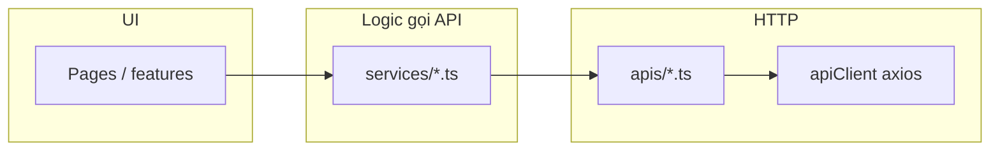
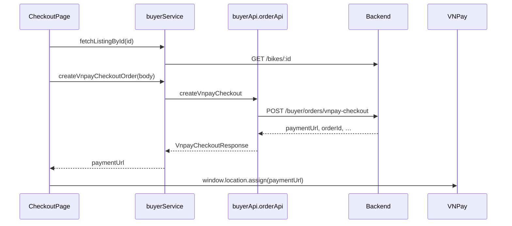

# Luồng gọi API trên Frontend (ShopBike)

> Hướng dẫn **tầng code**, **luồng nghiệp vụ** và **cách xử lý response/lỗi** khi frontend gọi backend — **gồm phần chi tiết từng bước** (checkout → VNPay → transaction → finalize → success/review).  
> Bổ sung cho [BE-FE-API-AUDIT-BY-PAGE.md](BE-FE-API-AUDIT-BY-PAGE.md) (mapping trang → endpoint) và [QUICK-REFERENCE.md](QUICK-REFERENCE.md) (bảng path tóm tắt).

## Mục lục

1. [Mục đích & đọc kèm](#1-mục-đích--đọc-kèm)  
2. [Kiến trúc tầng (FE)](#2-kiến-trúc-tầng-fe)  
3. [Biến môi trường & mock](#3-biến-môi-trường--chế-độ-mock)  
4. [Chuẩn request / response](#4-chuẩn-request--response)  
5. [Luồng API chi tiết theo tính năng](#5-luồng-api-chi-tiết-theo-tính-năng)  
6. [Trạng thái đơn → API / UI (buyer)](#6-trạng-thái-đơn--api--ui-buyer)  
7. [Bảng tham chiếu nhanh: màn hình → service](#7-bảng-tham-chiếu-nhanh-màn-hình--service--api)  
8. [Khi sửa API hoặc thêm tính năng](#8-khi-sửa-api-hoặc-thêm-tính-năng)

---

## 1. Mục đích & đọc kèm

**Trước khi đọc sâu:** chạy được dự án theo [README.md](../README.md) (`.env`, `npm run dev`) để có thể đối chiếu code thật với các mục §5–§7.

| Nhu cầu | Tài liệu |
|---------|----------|
| Chạy FE/BE, env, xử lý sự cố | [README.md](../README.md) |
| Bảng path API, env, thuật ngữ | [QUICK-REFERENCE.md](QUICK-REFERENCE.md) |
| Từng **trang** gọi API nào | [BE-FE-API-AUDIT-BY-PAGE.md](BE-FE-API-AUDIT-BY-PAGE.md) |
| Contract BE (Node/Spring) | [BACKEND-NODE-TO-SPRING-BOOT.md](BACKEND-NODE-TO-SPRING-BOOT.md) |
| Lỗi API, timeout, 401 | [PRODUCTION-HARDENING.md](PRODUCTION-HARDENING.md), `src/lib/apiErrors.ts` |
| Cấu trúc thư mục `src/` | [STRUCTURE.md](STRUCTURE.md) |

---

## 2. Kiến trúc tầng (FE)

Luồng dữ liệu một chiều từ UI xuống HTTP:

| Tầng | Vai trò | File tiêu biểu |
|------|---------|----------------|
| **`src/lib/apiConfig.ts`** | `API_BASE_URL`, `API_TIMEOUT`, `USE_MOCK_API`, hằng **`API_PATHS`** (path tương đối sau `/api`) | Mọi thay đổi URL API tập trung ở đây |
| **`src/lib/apiClient.ts`** | Axios instance: gắn **`Authorization: Bearer`**, xóa `Content-Type` khi body là **`FormData`**, **401 → clearTokens** | Không gọi trực tiếp từ page nếu có thể qua service |
| **`src/apis/*.ts`** | Hàm mỏng: `apiClient.get/post/put` + path từ `API_PATHS`, **unwrap** `r.data?.data ?? r.data` (hoặc `content` cho list bikes/orders) | `authApi`, `buyerApi`, `sellerApi`, `bikeApi`, … |
| **`src/services/*.ts`** | Orchestration: mock, timeout, fallback, gọi nhiều API, map lỗi nghiệp vụ | `buyerService`, `sellerService`, `reviewService` |
| **Pages / stores** | Gọi **service** (hoặc đôi khi `authApi` trực tiếp); token trong **`useAuthStore`** | `CheckoutPage`, `SellerListingEditorPage`, … |

**Nguyên tắc:** thêm endpoint mới → cập nhật **`API_PATHS`** → thêm/thay **`apis/*`** → bọc trong **`services/*`** nếu cần mock hoặc xử lý lỗi chung → gọi từ page.

---

## 3. Biến môi trường & chế độ mock

| Biến | Ý nghĩa |
|------|---------|
| `VITE_API_BASE_URL` | Base URL có suffix **`/api`** (vd. `http://localhost:8081/api`) |
| `VITE_USE_MOCK_API` | `true` → nhiều service trả dữ liệu giả, không gọi BE |
| `VITE_API_TIMEOUT` | Timeout ms (mặc định 15000; upload ảnh seller dùng timeout riêng 120s trong `sellerApi.uploadListingImages`) |

**Mock chủ yếu tại:** `buyerService` (listing + order fallback), `sellerService` (dashboard, listings, upload ảnh trả URL giả), `reviewService`, một số trang auth/forgot (đọc `VITE_USE_MOCK_API` cục bộ).

**Lưu ý:** `buyerService` khi `USE_MOCK_API === false` vẫn có thể **fallback mock** nếu request ném lỗi (mạng/BE tắt) — tùy hàm; đọc từng hàm khi debug.

---

## 4. Chuẩn request / response

### 4.1 Auth

- Mọi request qua `apiClient`: nếu `useAuthStore.getState().accessToken` có giá trị → header **`Authorization: Bearer <token>`**.
- **401:** interceptor xóa token (user coi như đăng xuất về phía client); UI có thể redirect login tùy route guard.

### 4.2 JSON

- Mặc định header **`Content-Type: application/json`**.
- Backend thường trả **`{ data: ... }`** hoặc JSON phẳng; FE unwrap kiểu **`r.data?.data ?? r.data`** trong `apis/*`.

### 4.3 Multipart (upload ảnh tin seller)

- **`POST /api/seller/listings/upload-images`**, field **`images`** (lặp).
- `apiClient` **xoá** `Content-Type` để trình duyệt gắn boundary cho `FormData`.
- Response: **`{ data: { urls: string[] } }`** — URL thường trỏ tới **`/uploads/listings/...`** trên host BE (không qua prefix `/api`).

### 4.4 Ảnh hiển thị (``)

- URL tuyệt đối từ BE (vd. `http://localhost:8081/uploads/listings/uuid.jpg`) — **không** đi qua `apiClient`; trình duyệt tải trực tiếp.

### 4.5 Lỗi

- Backend hay trả **`{ message: string }`**.
- Dùng **`getApiErrorMessage(err, fallback)`** (`src/lib/apiErrors.ts`) để hiển thị: đọc `message`, timeout, mất mạng, 403/404/5xx.

---

## 5. Luồng API chi tiết theo tính năng

Các bước dưới đây khớp code trong `src/pages/*.tsx` và `src/services/*.ts` (tên file trong ngoặc).

### 5.1 Đăng nhập / đăng ký / session

| Bước | Hành động FE | API / lưu ý |
|------|----------------|-------------|
| 1 | User submit form login/register | `authApi.login` / `authApi.signup` → `POST /auth/login`, `POST /auth/signup` |
| 2 | Lưu token | `useAuthStore.setState({ accessToken, … })` — mọi request sau gắn Bearer qua `apiClient` |
| 3 | (Tuỳ trang) Đồng bộ profile | `authApi.getProfile` → `GET /auth/me` (subscription seller, role, …) |
| 4 | Token hết hạn / 401 | Interceptor `apiClient` gọi `clearTokens()` |

### 5.2 Khách — danh sách & chi tiết xe

| Bước | Trang / ngữ cảnh | Service / API |
|------|------------------|---------------|
| 1 | Home / listing grid | `buyerService.fetchListings()` → `bikeApi.getAll()` → **`GET /bikes`** |
| 2 | Chi tiết xe | `fetchListingById(id)` → **`GET /bikes/:id`** — nếu tin **RESERVED/SOLD** có thể **404** (chuẩn BE) |
| 3 | Vào checkout | `CheckoutPage` mount → lại **`fetchListingById`** để hiển thị giá, điều kiện disclaimer |

### 5.3 Buyer — đặt mua & VNPay (CheckoutPage → redirect)

**File:** `src/pages/CheckoutPage.tsx` — service: `createVnpayCheckoutOrder` → `buyerApi.orderApi.createVnpayCheckout`.

**Trình tự:**

1. **Mount:** `useEffect` gọi **`fetchListingById(id)`** — nếu null → màn lỗi / về home.
2. **Xe chưa kiểm định** (`isBuyerUnverifiedRisk(listing)`): bật dialog chính sách; user phải xác nhận trước khi thanh toán.
3. **Submit:** validate địa chỉ (`street`, `city`), checkbox đồng ý điều khoản.
4. **Body `POST /buyer/orders/vnpay-checkout`:**
   - `listingId`: id tin (string, khớp BE Mongo/ObjectId).
   - `plan`: `DEPOSIT` | `FULL`.
   - `shippingAddress`: `{ street, city }` (postalCode tuỳ).
   - `acceptedUnverifiedDisclaimer`: **`true`** nếu bước 2 áp dụng; nếu không gửi khi BE bắt buộc → lỗi **`UNVERIFIED_DISCLAIMER_REQUIRED`**.
5. **Response:** object có **`paymentUrl`** — FE gọi **`window.location.assign(url)`** rời SPA sang VNPay Sandbox.
6. **Mock:** `VITE_USE_MOCK_API=true` → `createVnpayCheckoutOrder` **ném lỗi** (bắt buộc BE thật cho VNPay).

**Lưu ý:** **`fulfillmentType`** (`WAREHOUSE` / `DIRECT`) do **BE** gán khi tạo đơn; FE **không** đưa vào body checkout.

### 5.4 Buyer — theo dõi đơn (TransactionPage)

**File:** `src/pages/TransactionPage.tsx` — `fetchOrderById`, `resumeVnpayCheckoutOrder`, `cancelOrder`, `fetchListingById`, `listingSnapshotToDetail`.

**Tham số URL / state:**

- Route: **`/transaction/:id`** với `:id` = **listingId**.
- **`orderId`:** từ query **`?orderId=`** hoặc **`location.state.orderId`** (sau checkout hoặc sau redirect từ `VnpayResultPage`).

**Luồng load lần đầu (`useEffect`):**

1. Nếu có `orderIdToFetch` → **`fetchOrderById(orderId)`** — **`GET /buyer/orders/:id`**.
2. Kiểm tra `order.listingId` (hoặc snapshot) khớp `:id` trong URL; nếu không → bỏ dùng order đó.
3. Đồng bộ UI từ order: `status`, `plan`, `vnpayPaymentStatus`, `depositAmount`, `fulfillmentType`, `expiresAt`, `shippingAddress`, …
4. **`fetchListingById(id)`** — nếu listing không còn public (RESERVED/SOLD) → fallback **`listingSnapshotToDetail`** từ **`order.listing`**.

**Luồng bổ sung:**

| Hành động user | API |
|----------------|-----|
| Thanh toán VNPay chưa xong (`vnpayPaymentStatus === PENDING_PAYMENT`) | **`resumeVnpayCheckoutOrder(orderId)`** → **`POST /buyer/orders/:id/vnpay-resume`** → redirect `paymentUrl` |
| Hủy đơn (theo điều kiện UI) | **`cancelOrder(orderId)`** → **`PUT /buyer/orders/:id/cancel`** |

**Polling:** Khi `order.status` thuộc nhóm chờ giao (`PENDING_SELLER_SHIP`, `SELLER_SHIPPED`, `AT_WAREHOUSE_PENDING_ADMIN`, `RE_INSPECTION`, `RE_INSPECTION_DONE`), mỗi **5 giây** gọi lại **`fetchOrderById`** để cập nhật khi seller/admin đổi trạng thái (vd. chuyển **SHIPPING**).

### 5.5 Buyer — hoàn tất nhận hàng (FinalizePurchasePage)

**File:** `src/pages/FinalizePurchasePage.tsx` — `fetchOrderById`, `fetchListingById`, `payBalanceVnpayOrder`, `completeOrder`.

**Load dữ liệu:**

1. Ưu tiên có **`orderId`** (query/state): **`fetchOrderById`** → lấy snapshot **`order.listing`** qua **`listingSnapshotToDetail`** (vì **`GET /bikes/:id`** có thể 404 khi tin RESERVED).
2. Không có order / fallback: **`fetchListingById(id)`**.

**Query đặc biệt:** `?vnpay_balance=1` (sau khi thanh toán số dư VNPay) → `useEffect` gọi lại **`fetchOrderById`** để cập nhật `balancePaid`.

**Hành động:**

| Nút / điều kiện | API |
|-----------------|-----|
| Plan DEPOSIT, còn số dư, chưa `balancePaid` | **`payBalanceVnpayOrder(orderId)`** → **`POST /buyer/orders/:id/vnpay-pay-balance`** → `window.location.href = paymentUrl` |
| Xác nhận đã nhận xe (đủ điều kiện `SHIPPING`) | **`completeOrder(orderId)`** → **`PUT /buyer/orders/:id/complete`** → navigate **`/success/:id`** kèm `state` (orderId, totals, …) |

### 5.6 Buyer — thành công & đánh giá (PurchaseSuccessPage)

**File:** `src/pages/PurchaseSuccessPage.tsx` — `fetchOrderById`, `fetchListingById`, `createReview` (`reviewService` → `reviewApi.createForOrder`).

**Load:**

1. Nếu có **`state.orderId`**: **`fetchOrderById`** → build listing từ snapshot; gắn **`seller.id`** từ **`order.sellerId`** nếu cần cho form review.
2. Ngược lại: **`fetchListingById(id)`**.

**Gửi đánh giá:**

- **`createReview({ orderId, listingId, sellerId, rating, comment })`** → **`POST /buyer/orders/:orderId/review`** (sau `VITE_API_BASE_URL`, vd. `.../api` + path — `API_PATHS.REVIEWS.CREATE_FOR_ORDER`, `reviewApi.createForOrder`).

### 5.7 Trang kết quả VNPay (VnpayResultPage)

**File:** `src/pages/VnpayResultPage.tsx` — **không gọi API**; chỉ đọc **query** (`ok`, `gate`, `listingId`, `orderId`, …) sau khi BE redirect từ `/payment/vnpay-return` (luồng demo) hoặc cấu hình tương đương.

- Nếu `gate=buyer` và có `listingId`: nút dẫn tới **`/transaction/:listingId?orderId=...`** kèm `state` để TransactionPage tiếp tục.

### 5.8 Seller — tin đăng & upload ảnh (chi tiết)

**File:** `src/pages/SellerListingEditorPage.tsx`.

| Bước | API / xử lý |
|------|-------------|
| Load form sửa | `fetchListingById` (seller) → **`GET /seller/listings/:id`**; đổ `imageUrls` vào slot ảnh |
| Chọn ảnh máy | Preview blob (`URL.createObjectURL`) — chưa gọi BE |
| Lưu nháp / đăng / kiểm định | **`resolveImageUrlsForSave()`** → **`uploadListingImages(files)`** → **`POST /seller/listings/upload-images`** (multipart `images`) |
| Sau upload | `createListing` / `updateListing` với **`imageUrls`** URL tuyệt đối |
| Đăng bài / kiểm định | **`publishListing`**, **`submitForInspection`** → **`PUT .../publish`**, **`PUT .../submit`** |

### 5.9 Seller — dashboard đơn; Inspector; Admin (tóm tắt)

| Actor | API chính (FE) |
|-------|----------------|
| Seller | `sellerApi.getOrders` → **`GET /seller/orders`**; `shipOrderToBuyer` → **`PUT .../ship-to-buyer`**; mark shipped warehouse qua listing — xem `sellerApi`, `STRUCTURE.md` |
| Inspector | `inspectorApi` — pending listing, **`getListingById`** (GET `/inspector/listings/:id`, tin mọi trạng thái), approve / reject / need-update |
| Admin | `adminApi` — warehouse pending, confirm warehouse, re-inspection, users, listings, brands, reviews |

Chi tiết từng trang: [BE-FE-API-AUDIT-BY-PAGE.md](BE-FE-API-AUDIT-BY-PAGE.md).

---

## 6. Trạng thái đơn → API / UI (buyer)

Bảng hỗ trợ đọc code **TransactionPage** / **FinalizePage**: khi BE trả `status` / `vnpayPaymentStatus` nào thì UI thường gọi gì tiếp.

| Tín hiệu / trạng thái | Ý nghĩa gần đúng (tuỳ BE) | Hành động FE điển hình |
|------------------------|---------------------------|-------------------------|
| `vnpayPaymentStatus === PENDING_PAYMENT` | Chưa thanh toán xong cọc/full | Nút “tiếp tục thanh toán” → **`vnpay-resume`** |
| `plan === DEPOSIT` && `!balancePaid` && đơn **SHIPPING** | Còn số dư | Finalize: **`vnpay-pay-balance`** |
| `status === SHIPPING` | Đang giao — buyer có thể hoàn tất | Finalize: **`complete`** |
| Các status “chờ seller/kho” | Xem §5.4 | **Polling** `GET /buyer/orders/:id` mỗi 5s |

Luồng nghiệp vụ đầy đủ (kho vs direct): [business-rules/BUSINESS-RULES.md](business-rules/BUSINESS-RULES.md), [PROJECT-SUMMARY.md](PROJECT-SUMMARY.md).

---

## 7. Bảng tham chiếu nhanh: màn hình → service / API

| Khu vực | Trang (file) | Service / API chính |
|---------|----------------|---------------------|
| Login, Register, Me | `LoginPage`, `RegisterPage`, … | `authApi` |
| Home, Product detail | `HomePage`, `ProductDetailPage` | `buyerService` + `bikeApi`; **Inspector/Admin** trên `/bikes/:id` thêm **`fetchListingByIdForInspector`** khi tin không có trên `GET /bikes/:id` (pending) hoặc khi có token (fallback hydrate) |
| Checkout | `CheckoutPage` | `createVnpayCheckoutOrder` |
| Theo dõi đơn | `TransactionPage` | `fetchOrderById`, `resumeVnpayCheckoutOrder`, `cancelOrder` |
| Hoàn tất | `FinalizePurchasePage` | `payBalanceVnpayOrder`, `completeOrder` |
| Thành công + review | `PurchaseSuccessPage` | `fetchOrderById`, `createReview` |
| Kết quả VNPay | `VnpayResultPage` | (query only, link tới transaction) |
| Seller editor | `SellerListingEditorPage` | `uploadListingImages`, `createListing`, `updateListing`, `publishListing` |
| Seller dashboard | `SellerDashboardPage`, … | `sellerService`, `sellerApi` |
| Đánh giá (khác) | Profile / admin | `reviewService`, `reviewApi` |
| Inspector / Admin | `Inspector*`, `Admin*` | `inspectorApi`, `adminApi` |
| Brands | Seller form, home | `brandsApi` |

---

## 8. Khi sửa API hoặc thêm tính năng

1. Cập nhật **`API_PATHS`** và **`apis/*`**.
2. Đồng bộ **`services/*`** (mock, unwrap, type).
3. Cập nhật **types** trong `src/types/*` nếu JSON đổi.
4. Cập nhật **tài liệu này** (mục 5–6) nếu thay đổi bước UI hoặc thứ tự gọi API.
5. Ghi lại trong **[BE-FE-API-AUDIT-BY-PAGE.md](BE-FE-API-AUDIT-BY-PAGE.md)** hoặc **[CHANGELOG.md](CHANGELOG.md)** nếu contract thay đổi hành vi.

---

*Tài liệu đồng bộ với codebase: `CheckoutPage`, `TransactionPage`, `FinalizePurchasePage`, `PurchaseSuccessPage`, `VnpayResultPage`, `SellerListingEditorPage`, `ProductDetailPage` (inspector fallback), `buyerService`, `buyerApi`, `reviewService`. Cập nhật khi thêm luồng API mới. Cập nhật: 2026-03-26 — inspector GET listing + Product detail.*
