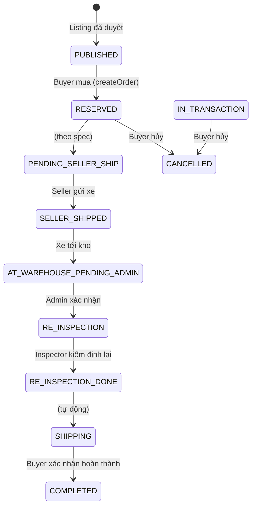
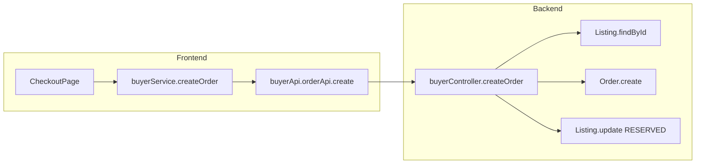
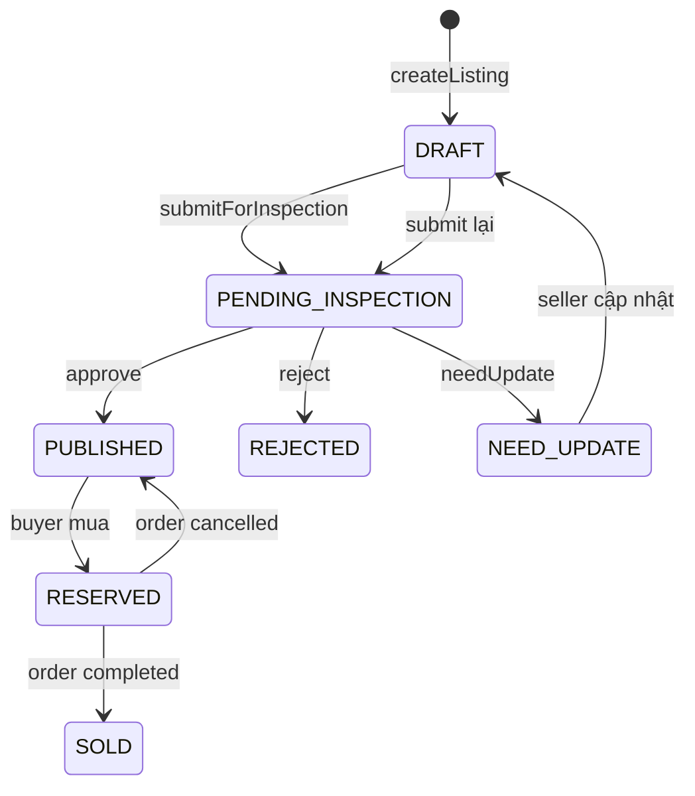

# BÁO CÁO KIỂM KÊ HỆ THỐNG SHOPBIKE

> Tài liệu kiểm kê logic và luồng đi của toàn bộ hệ thống (Frontend + Backend)

---

## 1. Cấu trúc thư mục, Models, Routes, Controllers

### 1.1 Cấu trúc thư mục

```
c:\SWP\frontend\
├── backend/
│   └── src/
│       ├── config/         # db.js - kết nối MongoDB
│       ├── constants/      # messages.js, httpStatus.js
│       ├── controllers/    # auth, bikes, buyer, seller, inspector, admin, payment, review
│       ├── middleware/    # auth.js - JWT, requireRole
│       ├── middlewares/   # auth.middlewares.js (re-export), error.middlewares.js
│       ├── models/        # User, Listing, Order, Review, Errors
│       ├── routes/        # auth, bikes, buyer, seller, inspector, admin
│       ├── utils/         # handler.js (wrapAsync), http.js
│       ├── seed.js
│       └── server.js
├── src/
│   ├── apis/              # bikeApi, buyerApi, sellerApi, adminApi, inspectorApi, authApi, reviewApi
│   ├── components/        # common (Header, Logo), listing, ui
│   ├── features/          # auth, bikes, buyer, landing, seller, support, inspector
│   ├── layouts/           # MainLayout
│   ├── lib/               # apiConfig, apiClient, orderOverrides, workflow, validateExpiry
│   ├── locales/           # vi.json, en.json – i18n (react-i18next)
│   ├── mocks/             # mockListings, bikeApi.mock
│   ├── pages/             # AdminDashboard, InspectorDashboard, Checkout, Profile, ...
│   ├── services/          # buyerService, sellerService, adminService, inspectorService, reviewService
│   ├── shared/            # RequireAuth, RequireBuyer, RequireSeller, RequireAdmin, RequireInspector
│   ├── stores/            # useAuthStore, useWishlistStore, useNotificationStore
│   └── types/             # order, shopbike, auth, listing, review
└── docs/
    ├── ERD-SPEC.md
    └── KIEM-KE-HE-THONG.md (file này)
```

### 1.2 Models (MongoDB/Mongoose)

| Model | File | Mô tả |
|-------|------|-------|
| **User** | `backend/src/models/User.js` | email, passwordHash, role (BUYER/SELLER/INSPECTOR/ADMIN), displayName, isHidden, hiddenAt, resetPasswordToken, resetPasswordExpiresAt |
| **Listing** | `backend/src/models/Listing.js` | title, brand, model, year, frameSize, condition, price, msrp, currency, location, thumbnailUrl, imageUrls, state, inspectionResult, inspectionScore, inspectionSummary, inspectionNeedUpdateReason, specs, description, seller (embedded), isHidden, hiddenAt |
| **Order** | `backend/src/models/Order.js` | buyerId, listingId, status, plan, totalPrice, depositAmount, depositPaid, shippingAddress, shippedAt, warehouseConfirmedAt, reInspectionDoneAt, expiresAt, listing (snapshot) |
| **Review** | `backend/src/models/Review.js` | orderId, listingId, sellerId, buyerId, rating, comment, status |

### 1.3 Routes & Controllers

| Route prefix | File | Controller | Mô tả |
|--------------|------|------------|-------|
| `/api/auth` | authRoutes.js | authController | signup, login, me, forgot-password, reset-password |
| `/api/bikes` | bikesRoutes.js | bikesController | listBikes, getBike (public) |
| `/api/buyer` | buyerRoutes.js | buyerController, paymentController, reviewController | orders CRUD, payments/initiate, reviews |
| `/api/seller` | sellerRoutes.js | sellerController | dashboard, listings CRUD, submitForInspection, orders |
| `/api/inspector` | inspectorRoutes.js | inspectorController | pendingListings, approve, reject, needUpdate |
| `/api/admin` | adminRoutes.js | adminController, reviewController | warehouse, re-inspection, users, listings, reviews |

---

## 2. Roles và quyền hạn

### 2.1 Ma trận quyền

| Chức năng | BUYER | SELLER | INSPECTOR | ADMIN |
|-----------|-------|--------|-----------|-------|
| Xem marketplace (bikes) | ✅ | ✅ | ✅ | ✅ |
| Mua hàng, tạo đơn | ✅ | ❌ | ❌ | ✅ |
| Xem/hủy/hoàn thành đơn của mình | ✅ | ❌ | ❌ | ✅ |
| Đánh giá sau mua | ✅ | ❌ | ❌ | ✅ |
| Tạo/sửa listing | ❌ | ✅ | ❌ | ❌ |
| Gửi listing kiểm định | ❌ | ✅ | ❌ | ❌ |
| Xem đơn cần gửi xe | ❌ | ✅ | ❌ | ❌ |
| Kiểm định listing mới | ❌ | ❌ | ✅ | ✅ |
| Kiểm định lại tại kho | ❌ | ❌ | ✅ | ✅ |
| Xác nhận xe tới kho | ❌ | ❌ | ❌ | ✅ |
| Quản lý users/listings (ẩn) | ❌ | ❌ | ❌ | ✅ |
| Quản lý reviews | ❌ | ❌ | ❌ | ✅ |
| Thống kê dashboard | ❌ | ❌ | ❌ | ✅ |

### 2.2 Middleware auth

- **requireAuth**: JWT Bearer token, kiểm tra user tồn tại và **không bị ẩn** (`isHidden`).
- **requireRole(roles)**: kiểm tra `req.user.role` thuộc danh sách roles.

### 2.3 Route guards (Frontend)

| Guard | File | Điều kiện |
|-------|------|-----------|
| RequireAuth | RequireAuth.tsx | Có accessToken |
| RequireBuyer | RequireBuyer.tsx | role === "BUYER" |
| RequireSeller | RequireSeller.tsx | role === "SELLER" |
| RequireAdmin | RequireAdmin.tsx | role === "ADMIN" |
| RequireInspector | RequireInspector.tsx | role === "INSPECTOR" hoặc "ADMIN" |

---

## 3. Luồng đơn hàng (Order lifecycle)

### 3.1 Sơ đồ luồng (Mermaid)



### 3.2 Thực tế trong code (Demo flow)

**Lưu ý:** Trong `buyerController.createOrder`, đơn được tạo với `status: "SELLER_SHIPPED"` và `shippedAt: new Date()` ngay lập tức, tức là bỏ qua PENDING_SELLER_SHIP và RESERVED. Đây là luồng demo/simplified.

| Bước | Trạng thái Order | Trạng thái Listing | Hành động |
|------|------------------|--------------------|-----------|
| 1 | - | PUBLISHED | Buyer mua → createOrder |
| 2 | SELLER_SHIPPED (demo) | RESERVED | Listing chuyển RESERVED |
| 3 | SELLER_SHIPPED / AT_WAREHOUSE_PENDING_ADMIN | - | Seller gửi xe (logic ngoài code) |
| 4 | RE_INSPECTION | - | Admin xác nhận xe tới kho |
| 5 | SHIPPING | - | Inspector xác nhận kiểm định lại |
| 6 | COMPLETED | SOLD | Buyer xác nhận hoàn thành |

### 3.3 Chuyển trạng thái Order

| Hành động | API | Từ status | Sang status |
|-----------|-----|-----------|-------------|
| Buyer mua | POST /buyer/orders | - | SELLER_SHIPPED (demo) |
| Admin xác nhận kho | PUT /admin/orders/:id/confirm-warehouse | SELLER_SHIPPED, AT_WAREHOUSE_PENDING_ADMIN | RE_INSPECTION |
| Inspector xác nhận kiểm định lại | PUT /admin/orders/:id/re-inspection-done | RE_INSPECTION | SHIPPING |
| Buyer hoàn thành | PUT /buyer/orders/:id/complete | RESERVED, IN_TRANSACTION, SELLER_SHIPPED, AT_WAREHOUSE_PENDING_ADMIN, RE_INSPECTION_DONE, SHIPPING | COMPLETED |
| Buyer hủy | PUT /buyer/orders/:id/cancel | RESERVED, IN_TRANSACTION | CANCELLED |

### 3.4 Luồng thông báo Seller

- **Khi Buyer mua:** Frontend polling `GET /seller/orders` mỗi 30s (trong Header khi role SELLER).
- **Khi có đơn mới** (so với lần fetch trước): Thêm thông báo local "Buyer đã mua hàng – cần gửi xe tới kho".
- **Store:** `useNotificationStore` (Zustand + persist), `sourceKey` để deduplicate.
- **Page:** `/notifications` – danh sách thông báo, đánh dấu đã đọc, xóa.

---

## 4. Các tính năng chính

### 4.1 Marketplace

- **API:** `GET /api/bikes`, `GET /api/bikes/:id`
- **Điều kiện hiển thị:** `state === "PUBLISHED"`, `inspectionResult === "APPROVE"`, `isHidden !== true`
- **Frontend:** HomePage, ProductDetailPage (`/bikes/:id`)

### 4.2 Mua hàng

- **Luồng:** ProductDetail → Checkout (`/checkout/:id`) → validatePayment → createOrder → FinalizePurchase → PurchaseSuccess
- **API:** POST /buyer/orders, POST /buyer/payments/initiate
- **Validation:** listing không hidden, state PUBLISHED, inspectionResult APPROVE

### 4.3 Seller dashboard

- **Routes:** `/seller`, `/seller/stats`, `/seller/listings/new`, `/seller/listings/:id/edit`
- **API:** GET /seller/dashboard, GET /seller/listings, POST/PUT /seller/listings, PUT /seller/listings/:id/submit
- **Luồng listing:** DRAFT → submitForInspection → PENDING_INSPECTION → (Inspector) APPROVE/REJECT/NEED_UPDATE

### 4.4 Admin

- **Route:** `/admin`
- **Tabs:** Xác nhận xe tới kho, Quản lý users, Quản lý listings, Đánh giá, Danh mục, Giao dịch, Thống kê
- **API:** warehouse-pending, confirm-warehouse, users, hide-user, listings, hide-listing, reviews

### 4.5 Inspector

- **Route:** `/inspector`
- **Chức năng:** Kiểm định listing mới (approve/reject/needUpdate), Kiểm định lại tại kho (re-inspection)
- **API:** GET /inspector/pending-listings, PUT /inspector/listings/:id/approve|reject|need-update

### 4.6 Thông báo

- **Store:** `useNotificationStore` (Zustand + persist)
- **Page:** `/notifications`
- **Chức năng:** addNotification, markRead, markAllReadForRole, clearForRole
- **Lưu ý:** Chưa có webhook/push từ backend, thông báo do frontend tạo local (polling seller orders)

---

## 5. API endpoints và data flow

### 5.1 Tổng hợp endpoints

| Method | Path | Role | Mô tả |
|--------|------|------|-------|
| POST | /api/auth/signup | - | Đăng ký BUYER/SELLER |
| POST | /api/auth/login | - | Đăng nhập |
| GET | /api/auth/me | Auth | Thông tin user |
| POST | /api/auth/forgot-password | - | Quên mật khẩu |
| POST | /api/auth/reset-password | - | Đặt lại mật khẩu |
| GET | /api/bikes | - | Danh sách xe (public) |
| GET | /api/bikes/:id | - | Chi tiết xe |
| POST | /api/buyer/orders | BUYER, ADMIN | Tạo đơn |
| GET | /api/buyer/orders | BUYER, ADMIN | Đơn của buyer |
| GET | /api/buyer/orders/:id | BUYER | Chi tiết đơn |
| PUT | /api/buyer/orders/:id/complete | BUYER | Hoàn thành đơn |
| PUT | /api/buyer/orders/:id/cancel | BUYER | Hủy đơn |
| POST | /api/buyer/payments/initiate | BUYER | Validate thanh toán |
| POST | /api/buyer/orders/:id/review | BUYER | Tạo review |
| GET | /api/buyer/reviews | BUYER | Danh sách review |
| GET | /api/seller/dashboard | SELLER | Dashboard seller |
| GET | /api/seller/orders | SELLER | Đơn cần gửi xe |
| GET | /api/seller/listings | SELLER | Listings của seller |
| POST | /api/seller/listings | SELLER | Tạo listing |
| PUT | /api/seller/listings/:id | SELLER | Cập nhật listing |
| PUT | /api/seller/listings/:id/submit | SELLER | Gửi kiểm định |
| GET | /api/inspector/pending-listings | INSPECTOR, ADMIN | Listings chờ kiểm định |
| PUT | /api/inspector/listings/:id/approve | INSPECTOR, ADMIN | Duyệt listing |
| PUT | /api/inspector/listings/:id/reject | INSPECTOR, ADMIN | Từ chối listing |
| PUT | /api/inspector/listings/:id/need-update | INSPECTOR, ADMIN | Yêu cầu cập nhật |
| GET | /api/admin/orders/warehouse-pending | ADMIN | Đơn chờ xác nhận kho |
| PUT | /api/admin/orders/:id/confirm-warehouse | ADMIN | Xác nhận xe tới kho |
| GET | /api/admin/orders/re-inspection | ADMIN, INSPECTOR | Đơn kiểm định lại |
| PUT | /api/admin/orders/:id/re-inspection-done | ADMIN, INSPECTOR | Xác nhận kiểm định lại |
| GET | /api/admin/dashboard/stats | ADMIN | Thống kê |
| GET | /api/admin/users | ADMIN | Danh sách users |
| PUT | /api/admin/users/:id/hide | ADMIN | Ẩn user |
| GET | /api/admin/listings | ADMIN | Danh sách listings |
| PUT | /api/admin/listings/:id/hide | ADMIN | Ẩn listing |
| GET | /api/admin/reviews | ADMIN | Danh sách reviews |
| PUT | /api/admin/reviews/:id | ADMIN | Cập nhật review |

### 5.2 Data flow chính



---

## 6. Logic nghiệp vụ quan trọng

### 6.1 Validation

| Ngữ cảnh | Rule | File |
|----------|------|------|
| createOrder | listingId, plan, shippingAddress (Zod) | buyerController.js |
| createOrder | Listing tồn tại, không hidden, state PUBLISHED, inspectionResult APPROVE | buyerController.js |
| createListing | title, brand, price bắt buộc (Zod) | sellerController.js |
| submitForInspection | Có ít nhất 1 ảnh | sellerController.js |
| updateListing | Không sửa khi state PENDING_INSPECTION | sellerController.js |
| approve/reject/needUpdate | Listing state phải PENDING_INSPECTION | inspectorController.js |
| completeOrder | status trong [RESERVED, IN_TRANSACTION, SELLER_SHIPPED, AT_WAREHOUSE_PENDING_ADMIN, RE_INSPECTION_DONE, SHIPPING] | buyerController.js |
| cancelOrder | status phải RESERVED hoặc IN_TRANSACTION | buyerController.js |
| createReviewForOrder | Order status phải COMPLETED | reviewController.js |

### 6.2 Chuyển trạng thái Listing



### 6.3 Hidden user / listing

| Entity | Trường | Hành động | Ảnh hưởng |
|--------|--------|-----------|------------|
| User | isHidden, hiddenAt | Admin hide user | Login fail, requireAuth fail |
| Listing | isHidden, hiddenAt | Admin hide listing | Không hiển thị marketplace, createOrder fail |
| User | isHidden | - | `User.findById` + `user.isHidden` → 401 |
| Listing | isHidden | - | `listBikes` filter `$ne: true`, `getBike` return 404 |

### 6.4 Order overrides (Frontend)

- **orderOverrides** (localStorage): Ghi đè status/warehouseConfirmedAt/reInspectionDoneAt khi backend chưa cập nhật kịp.
- **applyOrderOverrides**: Áp dụng khi fetch danh sách đơn.

### 6.5 Điểm khác biệt FE–BE

- **Inspector approve:** FE gửi `inspectionReport` (frameIntegrity, drivetrainHealth, brakingSystem) nhưng BE hiện không dùng, chỉ set `inspectionScore = 4.5`.
- **createOrder:** BE tạo đơn với status SELLER_SHIPPED ngay, khác với luồng spec (RESERVED → PENDING_SELLER_SHIP → SELLER_SHIPPED).

---

## 7. Tóm tắt

- **4 models:** User, Listing, Order, Review.
- **4 roles:** BUYER, SELLER, INSPECTOR, ADMIN với phân quyền rõ ràng.
- **Luồng đơn:** Mua → Gửi kho → Admin xác nhận → Inspector kiểm định lại → Giao hàng → Hoàn thành.
- **Ẩn dữ liệu:** User và Listing có `isHidden`/`hiddenAt`, dùng cho moderation.
- **API:** REST trên Express, JWT auth, Zod validation.
- **Frontend:** React + Vite, React Router, Zustand, mock fallback khi backend lỗi.
- **Thông báo:** Polling 30s cho seller orders, thông báo local (icon chuông + trang /notifications).
